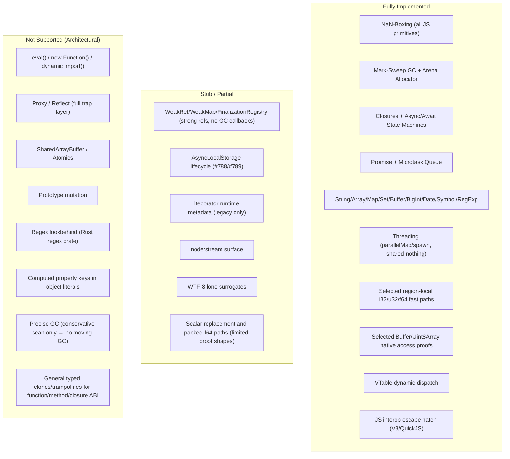

# Perry: Type Lowering & Native Runtime Support — Findings, Landed Scope, and Gaps

---

## 0. Live Acceptance Checklist

Status legend:

- `[x]` implemented in this branch with code/test evidence.
- `[~]` partially implemented; evidence exists for a narrow production path, but
  the architecture item is not complete.
- `[ ]` not complete for this branch yet.

### 2026-06-19 Integration / Material Gate Status

All six parallel worker tracks are integrated on this branch:

- typed ABI/clones: typed-f64 clones now admit proven raw `Int32` locals;
- arrays/effects: first packed-i32 store loop slice with versioned side exits;
- class/scalar: scalar method summaries now inline straight-line immutable
  local temporaries;
- strings/collections: `Set<string>` selected paths consume raw `StringRef`
  values through the native lowering dispatcher;
- async/BigInt: small BigInt literals lower as region-local `i128` and box only
  at JS-visible boundaries;
- verification/observability: packet freshness, release sentinel counts, and
  material-accounting contracts are reported and gated.

End-to-end smoke evidence:
`PYTHON=python3 RUSTC_WRAPPER= RUSTFLAGS=-Awarnings bash
tests/test_native_abi_evidence_packet_smoke.sh
tmp/native-abi-evidence-smoke-20260619T-integrated-fix2` passed.

The material packet proves a quantitative improvement rather than only local IR
shape:

- boxed Number allocations: control `3` -> typed `0` (100% reduction);
- Buffer slow-path helpers: control `6` -> typed `0` (100% reduction);
- array slow-path helpers: control `6` -> typed `0` (100% reduction);
- static runtime calls: control `324` -> typed `73` (77.5% reduction);
- traced allocations: control `640` -> typed `0` (100% reduction);
- static write-barrier helpers: control `11` -> typed `2` (81.8% reduction);
- traced write barriers: control `38580` -> typed `0` (100% reduction);
- median wall time: control `181.62ms` -> typed `8.11ms` (22.4x speedup);
- p95 wall time: control `184.29ms` -> typed `9.01ms` (20.4x speedup);
- release/LTO sentinel guard: `101/101` rooted symbols present, with runtime
  archive/source fingerprints recorded.

The gate matrix is fully passing for native ABI correctness, native-region
artifacts, explain-lowering accounting, runtime safety, and release/LTO symbol
guarding. This still does not claim a general typed function/method/closure ABI;
the proof is for the selected native/region-local lowering packet and the
tracked production slices above.

| Status | Architecture requirement | Current evidence / remaining work |
|---|---|---|
| `[~]` | Lower HIR values into typed SSA/native reps first | Region-local native reps exist for `i32`/`u32`, `i1`, `f64`, buffer views, packed numeric arrays, raw numeric fields, and selected `JsValueBits` consumers. A narrow value-first ordinary-expression path now keeps simple numeric literals, locals, local assignment, and numeric binary ops as `f64`, and simple boolean literals/locals/assignment/comparison/`!` as `i1`, until return/runtime materialization. Broad ordinary expression lowering is still predominantly generic `double` unless a local proof applies. Evidence: `representation_first_numeric_locals_stay_f64_until_abi` and `representation_first_boolean_locals_stay_i1_until_abi`. |
| `[~]` | Keep `JSValue` as ABI/fallback, not optimizer default | Public ABI remains `double`/NaN-box. First ordinary-function, own-instance-method, and local-closure typed-f64/typed-i1 candidates now keep raw `double`/`i1` clones behind public JSValue wrappers that guard arguments, call the typed clone on success, box/materialize at the ABI edge, and fall back to an internal generic body. Own-instance methods now also have a narrow `Int32... -> Int32` bitwise-safe clone: the public method symbol stays a JSValue wrapper/vtable target, exact direct calls guard receiver/method identity and Int32 args, call the internal `i32(...) -> i32` clone, and box only at the method ABI boundary. Ordinary functions also have a first string passthrough clone shape: the internal clone passes raw `StringHeader*` handles as `i64`, the public wrapper guards/unboxes JS strings, boxes the raw result with `js_nanbox_string`, and falls back to the generic body; same-module direct `FuncRef` calls with proven string args can call that raw clone directly after guards. Own-instance string passthrough methods now use the same raw `i64` string clone shape behind the public JSValue method wrapper, and exact direct method calls guard receiver/method identity plus string args before boxing only at the call boundary. Local typed string closures now use the same closure-aware raw string ABI (`i64 %this_closure, i64 string args... -> i64 string`) behind a public JSValue wrapper and guarded direct local call path, including immutable string captures guarded at wrapper/direct-call boundaries. Local typed closure clones now use a closure-aware internal ABI (`i64 %this_closure, typed args...`) and accept immutable typed captures for the conservative numeric/i32/boolean/string slices. Ordinary functions now also cover mixed native predicate shapes: `number... -> boolean` emits an internal `i1(double, ...)` clone after `f64` guards, `Int32... -> boolean` emits an internal `i1(i32, ...)` clone after finite/in-range integer guards, and straight-line `Int32... -> Int32` bitwise bodies emit an internal `i32(...) -> i32` clone that boxes only at public/direct-call ABI edges. Same-module direct `FuncRef` calls carry typed parameter reps and can call those clones directly after the matching guards. Async, built-in string methods/operators, dynamic string calls, escaping/unknown closures, mutable/boxed/`this`/`new.target` captures, inherited/dynamic method bodies beyond public wrapper dispatch, unsupported typed-string/i32 closure shapes, and most functions/methods still use generic ABI. |
| `[~]` | Use `i64 JSValueBits` internally for boxed values | `JsValueBits` records and selected production consumers exist, including write-barrier child selection, boxed local/parameter/PreallocateBoxes storage as raw `i64` box pointers, compiler-emitted closure capture slots for boxed/generic JSValue traffic as raw `i64` bits, `array.push` slot/runtime-helper value selection, and dynamic property/index-set RHS selection before boxing at the store/helper edge, including array runtime-key index setters. `ExpectedNativeRep::JsValueBits` now tries value-first lowering for ordinary native expressions and direct `f64`/proven-`i1`/integer/native-handle/promise-boundary materialization to boxed bits before falling back through `JSValue`. Public boolean parameters in generic bodies still enter as JSValue ABI locals unless a typed clone owns the call path. Hand-written runtime closure users keep the compatibility `f64` helper API, dynamic property/index helper edges beyond the covered store paths, and many generic expression paths still materialize through `double`. Evidence: `accepts_js_value_bits_materialization_transitions`, `artifact_records_direct_f64_to_js_value_bits_for_write_barrier`, `artifact_records_direct_i1_to_js_value_bits_for_write_barrier`, `artifact_records_write_barrier_child_js_value_bits`, `boxed_local_slot_uses_i64_js_value_bits_until_helper_edges`, `boxed_param_slot_uses_i64_js_value_bits_until_helper_edges`, `boxed_jsvalue_storage_uses_bits_helpers_for_strings_objects_and_tags`, `artifact_records_boxed_local_slot_as_js_value_bits`, `box_bits_roundtrips_non_number_tags_exactly`, `test_closure_capture_bits_roundtrip_tagged_values`, `artifact_records_array_push_value_bits_before_slot_store`, `artifact_records_dynamic_property_set_value_bits_before_helper`, `artifact_records_dynamic_index_set_value_bits_before_helper`, and `artifact_records_array_runtime_key_index_set_value_bits_before_helper`. |
| `[~]` | Rich TypeFacts/effect/range/escape lattice | Array-kind, array-stability, noalias, effect, unknown-call, alias, aggregate identity exposure, materialization-hazard facts, and a first async/microtask escape fact now feed packed-f64 and cached-length proofs. Loop array-length consumers now emit accepted/rejected effect-fact artifacts, including explicit async/microtask rejection records when an `await` would make cached length or bounded-index lowering unsafe. Object facts, field-sensitive escape/range facts, broader async/microtask summaries, and wider consumer coverage remain incomplete. Evidence: `async_microtask_escape_is_tracked_as_effect_fact`, `loop_length_effect_artifact_records_consumed_preservation_fact`, `async_microtask_effect_blocks_length_and_bounds_proofs_with_artifact_reason`, `aggregate_array_identity_exposure_marks_materialization_hazard`, `indirect_array_alias_from_container_blocks_length_and_bounds_proofs`, `loop_local_array_alias_push_blocks_packed_f64_loop_and_artifacts`, `hir_facts` unit tests, and invalidation regressions in `crates/perry-codegen/tests/native_proof_regressions/invalidation.rs`. |
| `[~]` | Late boxing only at true dynamic boundaries | Native fast paths reduce boxing in verified regions; straight-line numeric and boolean ordinary-expression slices now materialize `f64`/`i1` only at return/runtime compatibility boundaries. Ordinary bodies still frequently lower to JSValue/`double` early outside those proven slices. |
| `[~]` | Treat async/generator lowering as allocation lowering | Compiler-private async/generator control locals now avoid generic JSValue boxes for the narrow closure-shared control state: `__gen_state` / `__gen_pending_type` use typed `i32` heap cells, and `__gen_done` / `__gen_executing` use typed boolean heap cells. This preserves closure lifetime/sharing semantics while keeping control reads, writes, and `__gen_state === const` dispatch comparisons in native `i32`/`i1`. The compiler-private iter-result scratch slot now has raw-`f64`, raw-`i32`, and raw-`i1` handoffs for proven numeric, Int32, and boolean payloads: proven numeric payloads store raw, annotation-only numeric payloads coerce through `js_number_coerce` before raw storage, proven Int32 payloads store raw `i32` while annotation-only Int32 values stay off the raw-i32 slot, proven boolean payloads store raw `i1`, annotation-only boolean payloads stay generic, numeric consumers read through `js_iter_result_get_value_f64`, Int32 consumers read through `js_iter_result_get_value_i32`, boolean consumers read through `js_iter_result_get_value_i1`, and runtime side flags prevent GC from scanning raw primitive bits as roots. Public await/PROMISE resolution values, `__gen_sent`, pending values, async captures, and externally visible async boundaries remain JSValue/generic. Evidence: `compiler_private_async_control_cells_use_primitive_heap_boxes`, `artifact_records_compiler_private_async_control_cells`, `compiler_private_async_iter_result_f64_slot_uses_typed_handoff`, `compiler_private_async_iter_result_annotated_numeric_payload_is_coerced_before_raw_slot`, `artifact_records_compiler_private_async_iter_result_f64_handoff`, `compiler_private_async_iter_result_i32_slot_uses_typed_handoff`, `compiler_private_async_iter_result_annotated_i32_payload_stays_off_raw_i32_slot`, `artifact_records_compiler_private_async_iter_result_i32_handoff`, `compiler_private_async_iter_result_i1_slot_uses_typed_handoff`, `compiler_private_async_iter_result_annotated_boolean_payload_stays_generic`, `artifact_records_compiler_private_async_iter_result_i1_handoff`, `test_promise_iter_result_raw_f64_slot_is_not_scanned_as_root`, `test_promise_iter_result_raw_i32_slot_is_not_scanned_as_root`, `test_promise_iter_result_raw_i1_slot_is_not_scanned_as_root`, `primitive_control_boxes_round_trip_and_reject_foreign_pointers`, `representation_lowering_helpers_have_lto_keepalive_anchors`, and `test_runtime_symbol_guard_roots_async_control_box_helpers`. |
| `[~]` | Typed internal function/method/closure paths plus generic trampolines | Ordinary functions now have conservative typed-f64 clones for straight-line numeric return bodies, a bounded typed-i1 clone path for fixed-arity boolean-only functions with straight-line boolean return bodies, a first numeric-predicate typed-i1 function shape whose internal clone takes `double` params and returns `i1`, a first `Int32` predicate typed-i1 function shape whose internal clone takes raw `i32` params and emits signed integer comparisons, a first straight-line `Int32... -> Int32` bitwise return clone whose internal clone takes and returns raw `i32`, and a first fixed-arity typed-string passthrough clone whose internal clone takes and returns raw string handles as `i64`. Eligible ordinary functions expose the original public symbol as a JSValue trampoline and move the generic implementation to an internal `__generic` body; same-module direct calls can target f64/i32/i1/string clones when their arguments are proven and guarded. Exact own instance methods now use the same public-symbol wrapper shape for the narrower method-eligible boolean/numeric/string slices: runtime vtables register the public JSValue trampoline, typed clones stay internal, numeric-predicate method clones use `i1(double, ...)` or typed-param-rep internal signatures, straight-line `Int32... -> Int32` bitwise method clones use `i32(...) -> i32`, string passthrough method clones use `i64(string...) -> i64 string`, and guarded direct compiled calls jump to the internal generic method body on typed-argument guard failure. Eligible local closures expose the original closure function pointer as a JSValue trampoline, keep the generic closure body under `__generic`, and keep typed clones internal; numeric-predicate closure clones use `i1(i64 closure, typed args...)` internal signatures, and string passthrough closure clones use `i64(i64 closure, i64 string...)` internal signatures with `js_nanbox_string` only at wrapper/direct-call boundaries, and straight-line `Int32... -> Int32` bitwise closure clones use `i32(i64 closure, i32...)` internal signatures with JSValue boxing only at wrapper/direct-call boundaries. Typed closure clones now always receive `i64 %this_closure`; immutable f64/i32/i1/string capture slots are loaded through that handle and converted to native reps before body lowering, with string capture guards emitted before raw clone entry. Built-in string methods/operators, dynamic string call sites, unsupported string method bodies, mutable captures, boxed captures, `this`/`new.target` captures, dynamic closure values, unsupported typed-i32 closure shapes and escaping/async closure shapes remain generic. Evidence: `typed_i32_return_function_uses_i32_params_return_and_public_wrapper`, `artifact_records_typed_i32_function_clone_selection`, `typed_i32_return_function_rejects_annotation_only_or_unsafe_shapes`, `typed_i32_method_clone_emits_internal_clone_and_guarded_direct_call`, `typed_i32_method_public_trampoline_dispatches_before_generic_body`, `artifact_records_typed_i32_method_clone_selection`, `typed_i32_method_clone_rejects_number_param_number_return_and_unsafe_add`, `typed_string_function_clone_emits_internal_clone_and_guarded_wrapper`, `artifact_records_typed_string_direct_call_selection`, `typed_string_function_clone_rejects_unsupported_string_shapes`, `typed_string_method_clone_emits_internal_clone_and_guarded_direct_call`, `artifact_records_typed_string_method_clone_selection`, `typed_string_method_clone_rejects_unsupported_string_shapes`, `artifact_records_typed_string_method_clone_rejection_reason`, `typed_string_method_clone_rejects_dynamic_receiver_direct_call_site`, `typed_string_closure_clone_emits_internal_clone_and_guarded_direct_call`, `typed_string_closure_clone_accepts_immutable_string_capture`, `artifact_records_typed_string_closure_clone_selection`, `typed_string_closure_clone_rejects_any_and_mutable_capture`, `typed_string_closure_clone_rejects_dynamic_callee_call_site`, `typed_i1_numeric_predicate_function_uses_f64_params_and_public_wrapper`, `typed_i1_i32_predicate_function_uses_i32_params_and_public_wrapper`, `typed_i1_numeric_predicate_method_uses_f64_params_and_guarded_direct_call`, `typed_i1_numeric_predicate_closure_uses_f64_params_and_guarded_direct_call`, `typed_f64_public_trampoline_dispatches_before_generic_body`, `typed_i1_public_trampoline_dispatches_before_generic_body`, `typed_f64_method_public_trampoline_dispatches_before_generic_body`, `typed_i1_method_public_trampoline_dispatches_before_generic_body`, `typed_f64_function_clone_*`, `typed_i1_function_clone_*`, `typed_f64_method_clone_*`, `typed_i1_method_clone_*`, `typed_f64_closure_clone_*`, `typed_i1_closure_clone_*`, and `typed_i32_closure_clone_*` tests in `crates/perry-codegen/tests/native_proof_regressions.rs`. |
| `[~]` | Packed numeric array lowering/versioning with safe fallback | Guarded packed-f64 loop versioning and typed-feedback/runtime layout gates exist. Store-bearing shapes such as `arr[i] = arr[i] + number` and `arr[i] = Math.abs(arr[i])` now side-exit to the slow clone on store-guard failure instead of rejoining after boxed fallback; the unary math shape lowers the fast RHS to native `llvm.fabs.f64` only when the operand is the proven packed element, while coercive operands stay generic. `Int32[]` loops now have a packed-i32 versioning slice: read loops use the i32-specific layout guard, label fast/slow clones and artifacts as `packed_i32`, and materialize `arr[i]` as native `i32` inside the fast clone from the guarded raw numeric slot; a first store-bearing shape, `arr[i] = (arr[i] + i32_const) | 0`, keeps the RHS in the i32 lane, stores the exact f64 raw numeric slot after the packed-i32 store guard, and side-exits to the slow clone on guard failure. Release symbol guard coverage now roots/asserts the generated typed-feedback array helpers (`packed_f64_array_loop_guard`, `packed_i32_array_loop_guard`, numeric get/set guards, boxed fallbacks, numeric push, and companion array feedback helpers) so stale LTO/static archives fail before link. Dynamic fractional index fallback evidence now covers preserving the original runtime key for get/set and not truncating typed-array fractional numeric keys. Local alias mutation, length writes, unknown calls, materialization hazards, unsafe f64 stores to Int32 arrays, and unsafe store-then-read shapes still invalidate or reject the relevant cached-length/bounds/packed numeric proofs. The verifier now also gates the positive/fast-clone side of a packed-loop region as call-free: guard, load, and store records must stay region-local and carry no runtime-call materialization or dynamic fallback, while the dynamic side-exit/fallback records remain the only runtime-call boundary — proving Slice-3's "no unexpected runtime calls in positive hot regions" requirement. Broader effect summaries remain incomplete. Evidence: `verifier_accepts_call_free_packed_loop_region_record`, `verifier_rejects_packed_loop_region_runtime_materialization`, `verifier_rejects_packed_loop_region_escaping_region_local_state`, `verifier_rejects_packed_loop_region_dynamic_fallback_access_mode`, `packed_loop_positive_consumers_exclude_runtime_boundaries`, `packed_f64_loop_store_update_versions_with_side_exit`, `packed_f64_loop_unary_math_store_versions_with_side_exit`, `packed_f64_loop_rejects_coercive_unary_math_store_rhs`, `packed_i32_loop_read_materializes_integer_native_load_with_fallback`, `packed_i32_loop_store_update_versions_with_side_exit`, `packed_i32_loop_store_rejects_fractional_number_rhs`, `loop_local_array_alias_push_blocks_packed_i32_loop_and_artifacts`, packed-f64 invalidation regressions, `test_runtime_symbol_guard_roots_typed_feedback_array_helpers`, `typed_feedback_boxed_fallback_preserves_fractional_keys_for_array_like_receivers`, `typed_feedback_boxed_set_fallback_does_not_truncate_fractional_array_like_keys`, `dynamic_fractional_array_index`, and `scripts/check_runtime_symbols.sh target/release/libperry_runtime.a`. |
| `[~]` | Fixed/unboxed class field layout and direct typed field access | Raw numeric class-field fast paths exist for proven fields. Numeric consumers now use a raw-f64 class-field get path that keeps the guarded fast load as native `f64` and coerces only the boxed runtime fallback before the numeric merge. Raw numeric class-field get/set artifacts now carry explicit exact-declared-receiver, guarded class-id/keys, raw-f64 slot-array, and pointer-free bitmap notes; raw numeric stores also emit `WriteBarrierElided` evidence because the slot is proven non-pointer. Unknown receivers and computed/dynamic-shape class bodies do not claim raw slot access in their source function. General fixed mixed layouts and runtime pointer bitmaps are not complete. Evidence: `typed_feedback_guards_direct_class_field_specialization`, `artifact_records_raw_numeric_class_field_f64_fast_paths_and_fallback_reasons`, and `raw_numeric_class_field_rejects_unknown_or_dynamic_shape_receiver`. |
| `[~]` | Method/effect summaries for scalar replacement across simple method calls | Exact-receiver summaries exist for scalar-replaced class instances whose own method is fixed-arity and synchronous with either a numeric `return` over public numeric `this.field` reads/numeric params/arithmetic, a boolean comparison predicate over that same numeric subset, or a signed Int32 bitwise return over public Int32 fields/params/in-range literals. This lets `new Point(...).sum()` / `isAbove(n)` and narrow `new Flags(...).mix(i32)`-style calls inline against scalar field slots without heap allocation or method dispatch when arguments are proven in the current expression. Public `number`/`Int32` local arguments, plus arithmetic expressions over guarded numeric locals and literals, now use guarded fast paths: f64 summaries check `js_typed_f64_arg_guard`, Int32 bitwise summaries check `js_typed_i32_arg_guard`, and fallbacks materialize the scalar receiver before generic by-ID method dispatch. Schema-v15 artifacts give `scalar_method_summary` facts a structured `detail` field, so inline records distinguish `exact_receiver_summary` versus `guarded_numeric_args_fast_path`, while materialized fallbacks distinguish `generic_argument` versus `guarded_numeric_args_fallback`. Unproven `any` arguments/expressions, unsigned shifts, non-Int32 fields for Int32 summaries, and broader method shapes stay generic. Mutation/effect summaries, inherited/dynamic methods, field writes, `this` escape, accessors, dynamic property reads, nested/unknown calls, and broader non-numeric methods remain open. Evidence: `scalar_replaced_simple_method_call_inlines_summary_without_dispatch`, `artifact_records_scalar_replaced_method_summary_inline`, `scalar_replaced_boolean_method_predicate_inlines_without_dispatch_or_allocation`, `artifact_records_scalar_replaced_boolean_method_predicate_inline`, `scalar_replaced_int32_bitwise_method_inlines_without_dispatch_or_allocation`, `scalar_method_int32_bitwise_guards_public_int32_argument_and_preserves_fallback`, `scalar_method_int32_bitwise_rejects_unproven_or_unsigned_shapes`, `scalar_method_boolean_predicate_rejects_mutation_call_accessor_and_dynamic_property`, `scalar_method_boolean_predicate_rejects_unproven_numeric_arguments`, `scalar_method_boolean_predicate_rejects_unproven_numeric_argument_expressions`, `scalar_method_boolean_predicate_guards_public_numeric_arguments`, and `scalar_method_boolean_predicate_guards_public_numeric_argument_expressions`. |
| `[~]` | Interned property/method ID dispatch for hot static names | A first compatibility ID layer routes selected generated static-name property get/set, method fallback/apply, typed-feedback method-call, and class-method bind callsites through `*_by_property_id` / `*_by_id` wrappers. The current ID representation is the interned heap `StringHeader` pointer emitted by the StringPool, preserving existing semantics while removing raw byte-pointer/length plumbing from those callsites. Full global numeric IDs, vtable/property maps keyed directly by IDs, dynamic/computed keys, JS bridge calls, and broad specialized paths remain open. Evidence: `static_property_access_on_computed_class_uses_property_id_wrappers`, `static_name_method_fallback_uses_method_id_wrapper`, `static_name_spread_method_fallback_uses_method_id_wrapper`, and `static_name_class_method_value_uses_method_id_bind_wrapper`. |
| `[~]` | Unified safe string-like lowering | A first `PerryStringRef` resolver normalizes raw interned `StringHeader*` IDs, boxed heap-string IDs, and boxed SSO short-string IDs for the by-ID property/method wrappers. The typed-string function, own-instance-method, and local-closure ABIs add a non-throwing string-only guard/unbox pair for JS string arguments and immutable string captures, and materialize SSO strings only after the guard. These still use raw `StringHeader*` handles for the internal clone, not a full end-to-end `PerryStringRef` value representation; built-in string methods/operators, mutable string captures, dynamic receivers, unsupported string method bodies, and dynamic/computed lowering sites remain generic. Evidence: `dispatch_id_resolver_accepts_raw_heap_and_sso_string_forms`, `typed_string_arg_guard_is_non_throwing_and_string_only`, `typed_string_function_clone_emits_internal_clone_and_guarded_wrapper`, `artifact_records_typed_string_direct_call_selection`, `typed_string_method_clone_emits_internal_clone_and_guarded_direct_call`, `artifact_records_typed_string_method_clone_selection`, `typed_string_closure_clone_emits_internal_clone_and_guarded_direct_call`, `typed_string_closure_clone_accepts_immutable_string_capture`, and `artifact_records_typed_string_closure_clone_selection`. |
| `[~]` | Key-specialized Map/Set lowering | Runtime Map/Set side tables index numeric and string-content keys. Codegen now lowers proven `Map<string, V>.set/get/has/delete` and `Set<string>.add/has/delete` through string-key helpers, with typed Map value helpers for proven `number`/`Int32`/`PerryU32`/`PerryF32`/`boolean`/`string` set values and typed Set value helpers for proven `Int32`/`PerryU32`/`PerryF32`/`boolean`. It also lowers proven `Map<number, V>.set/get/has/delete` through guarded raw-f64 key helpers (`js_map_*_number_key`) and proven `Set<number>.add/has/delete` through guarded raw-f64 value helpers (`js_set_*_number`); guard failure and unproven values branch to the generic JSValue helpers. Helpers are rooted for release/LTO and covered by the runtime symbol guard. Native-rep artifacts record selected collection lanes with consumed type facts (`string_ref`, `f64`, `i32`, `u32`, `f32`, or `i1`) and rejected/generic lanes with rejected collection facts. Annotation-only typed values remain generic. Unboxed stored values beyond helper boundaries, dynamic receivers, and broader `Record`/dictionary lowering remain incomplete. Evidence: `map_number_key_set_get_has_delete_use_guarded_number_key_specialization`, `map_unproven_number_key_keeps_generic_fallback`, `artifact_records_map_number_key_helper_selection_and_rejection`, `set_number_add_has_delete_use_guarded_number_specialization`, `set_number_specialization_rejects_unproven_value`, `artifact_records_set_number_value_helper_selection_and_rejection`, `number_key_specialized_helpers_preserve_numeric_keys_and_fallback`, `test_set_number_specialized_helpers_preserve_numeric_values_and_fallback`, existing string/typed-value Map/Set artifact tests, `representation_lowering_helpers_have_lto_keepalive_anchors`, and `test_runtime_symbol_guard_roots_map_set_string_lowering_helpers`. |
| `[~]` | User-facing `--explain-lowering` report | `perry build/compile --explain-lowering` emits a fresh `.perry-trace/lowering/.../explain-lowering.json` report and text summary from native-rep artifacts. The report now includes explicit reason maps and evidence rows for typed-path selected/fallback/rejected decisions, typed-clone selected/rejected/not-recorded decisions, generic fallbacks, dynamic boundaries, boxes, unboxes/coercions, runtime property gets, direct field loads, scalar replacement selected/fallback/rejected decisions, bounds kept/eliminated, barriers emitted/eliminated, and selected/rejected collection helper lanes, including string-key Map/Set helpers, numeric Map/Set helpers, and typed-value Map/Set helpers. Evidence rows now carry consumed/rejected fact labels so selected and rejected typed paths are artifact-backed instead of note-only. Native-rep artifact summaries include consumed/rejected fact-kind counts and typed-path decision counts, and the verifier rejects malformed fact-use rows. Explain-lowering mode requests comprehensive typed-clone rejection records from codegen, including broad clone-family mismatches that default native-rep artifact runs suppress for noise control. A bounded non-clone completeness slice now derives concrete categories for scalar-replaced raw-f64 direct field loads, structured scalar-method summary details, generic write-barrier child-bit emissions, checked-native bounds records that lack an explicit `bounds_state`, collection helper selected/rejected decisions from artifact notes such as `selected_helper`, `generic_helper`, and `typed_collection_rejected`, and collection typed-value selected/rejected decisions from consumed/rejected `map.*_value_helper` and `set.*_value_helper` facts. Material evidence now reports/gates boxed-number allocations, buffer slow-path helpers, array slow-path helpers, traced allocations, write barriers, and wall-time speedups in the native ABI packet. Other absent non-clone proof is still reported as `not_recorded`. Evidence: `RUSTC_WRAPPER= RUSTFLAGS=-Awarnings cargo test -p perry lowering_report`, `RUSTC_WRAPPER= RUSTFLAGS=-Awarnings cargo test -p perry-codegen native_value::verify --lib`, `python3 -m unittest tests.test_compiler_output_regression tests.test_native_abi_evidence_report`, `report_classifies_scalar_method_inline_and_materialized_fallback_facts`, `report_counts_collection_helper_selection_and_rejection_reasons`, `report_derives_non_clone_reasons_without_explicit_reason_notes`, `report_counts_typed_clone_fallback_and_native_reps`, `verifier_accepts_structured_consumed_and_rejected_facts`, and `verifier_rejects_malformed_fact_uses`. |

## 0.1 Landed Scope for This Branch

This branch landed selected native/region-local type lowering and has begun the
typed internal ABI work. It is not yet a general typed function, method, or
closure ABI. Public user function, method, and closure entry points still use
the generic `double`/NaN-box ABI for parameters and returns. Eligible ordinary
typed-f64/typed-i1 functions now expose that public ABI through a wrapper under
the original symbol, with an internal typed clone plus an internal generic body
fallback. The typed-i1 ordinary-function path includes first mixed native
signatures for numeric predicates: an internal `i1(double, ...)` clone is called
from the public JSValue wrapper after numeric guards, and an internal
`i1(i32, ...)` clone is called for `Int32` predicates after non-throwing
finite/in-range integer guards. Same-module direct `FuncRef` calls now carry
typed parameter reps so they can guard/unbox `f64` or `i32` arguments and call
those clones directly while keeping a generic body fallback.
The ordinary-function path also has a first typed-i32 return slice for
fixed-arity `Int32` parameters and straight-line bitwise-preserving `Int32`
bodies. Its internal clone uses raw `i32` parameters and an `i32` return, while
the public wrapper and same-module direct call path guard/unbox arguments and
box the raw result only at the JSValue ABI boundary.
A first typed-string ordinary-function path accepts fixed-arity string
parameters and a string passthrough return; its internal clone takes and returns
raw `StringHeader*` handles as `i64`, while the public wrapper guards/unboxes
JS string arguments, boxes the raw result with `js_nanbox_string`, and falls
back to the internal generic body on guard failure. Same-module direct
`FuncRef` calls with proven string arguments can guard/unbox and call the raw
string clone directly, boxing only at the call boundary.
Eligible own-instance methods use the same shape: the original method
symbol is a JSValue wrapper registered in runtime vtables, and the generic
method body moves to an internal `__generic` symbol. A narrow set of direct
compiled calls may still branch to the same internal typed-f64 or typed-i1
function/method clones after guards pass, and those direct-call guard failures
target the generic body instead of re-entering the public wrapper. Eligible
local closures use the same wrapper/body split: the stored closure function
pointer remains the original public symbol, the generic closure body moves to
`__generic`, and internal raw-`double`/`i1` clones are called from the public
wrapper or guarded direct local closure call sites. Those typed closure clones
now take `i64 %this_closure` as their first internal parameter and can load
immutable typed capture slots as native f64/i1 values. The new native facts are
collected for module init, function, method, static-method, and closure bodies,
then consumed inside those bodies where a specific proof exists.

Compiler evidence for this branch covers:

- region-local integer facts (`i32`/`u32`), boolean facts (`i1`), and selected
  JS-number native reps;
- Buffer/Uint8Array `BufferView`/`U8` fast paths with explicit bounds and alias
  proof records;
- packed-`f64` array loop versioning guarded by typed-feedback/runtime layout
  checks, including the first safe store-update path whose store-guard failure
  side-exits/restarts in the slow clone instead of rejoining the raw fast clone.
  A narrow unary-math store RHS, `Math.abs(arr[i])`, also stays native in the
  fast clone as `llvm.fabs.f64` when the operand is the proven packed element,
  while coercive unary math operands remain on the generic ToNumber-preserving
  slow path. `Int32[]` loop slices now distinguish `packed_i32` array facts,
  emit `for.packed_i32_fast`/slow clones, materialize `arr[i]` as native `i32`
  inside read fast clones, and cover the first i32-preserving store update
  shape with slow-clone side exits on store-guard failure while preserving
  generic fallback and alias invalidation evidence;
- a narrow representation-first ordinary-expression path for simple numeric
  literals, locals, local assignment, and numeric binary ops, plus simple
  boolean literals, locals, local assignment, numeric/boolean comparisons, and
  unary `!`. Existing `lower_expr` callers materialize only when they still
  need a generic JSValue-compatible result. Evidence:
  `representation_first_numeric_locals_stay_f64_until_abi` and
  `representation_first_boolean_locals_stay_i1_until_abi`;
- array-kind, noalias, length-stability, local-alias mutation, aggregate
  array-identity exposure, unknown-call, and materialization hazard facts
  consumed by packed-array and cached-length proofs, including distinct
  `packed_i32` versus `packed_f64` array-kind facts for guarded loop lowering;
- raw numeric class-field get/set paths guarded by layout and field facts,
  including a numeric-consumer get variant that keeps the fast raw `f64` load
  native and moves `js_number_coerce` into the boxed fallback block before the
  merge. The artifacts now make the exact declared receiver proof observable
  with class-id/keys-shape guard notes, raw-f64 slot-array layout notes, and
  pointer-free bitmap notes. Raw numeric class-field stores also record
  `write_barrier.elided_raw_f64_class_field`; unknown receivers and
  computed/dynamic-shape class bodies are covered by negative evidence that
  they do not claim raw slot access in the source function;
- a key-specialized collection lowering slice for statically proven string and
  numeric collections. `Map<string, V>.set/get/has/delete` and
  `Set<string>.add/has/delete` lower through string-key runtime helpers when
  receiver type arguments and key/value expressions are proven string. Typed
  `Map<string, V>.set` value helpers cover proven `number`, `Int32`,
  `PerryU32`, `PerryF32`, `boolean`, and `string` values, boxing only at the
  map slot boundary. Typed `Set<Int32|PerryU32|PerryF32|boolean>` value helpers
  pass raw native values when the receiver type and value expression proof
  match; annotation-only values remain generic.
  `Map<number, V>.set/get/has/delete` now guards the boxed key with
  `js_typed_f64_arg_guard`, unboxes it with `js_typed_f64_arg_to_raw`, and calls
  `js_map_set_number_key`, `js_map_get_number_key`, `js_map_has_number_key`, or
  `js_map_delete_number_key`; guard failure and unproven keys call the generic
  JSValue helpers. `Set<number>.add/has/delete` follows the same guarded raw-f64
  pattern through `js_set_add_number`, `js_set_has_number`, and
  `js_set_delete_number`. `Map.get` still returns boxed `JSValue` so missing
  entries remain `undefined`.
  Selected collection-helper lanes emit native-rep records with consumed
  collection facts (`string_ref`, `f64`, `i32`, `u32`, `f32`, or `i1`);
  rejected/generic lanes emit rejected facts and guard-failure reasons for
  explain-lowering. The runtime helpers preserve numeric zero normalization and
  string content equality, are rooted in the release/LTO symbol guard, and are
  covered by runtime symbol sentinels. Dynamic receivers, unboxed stored values
  beyond helper boundaries, and broader Map/Set/Record typed storage remain
  generic/incomplete. Evidence:
  `map_number_key_set_get_has_delete_use_guarded_number_key_specialization`,
  `map_unproven_number_key_keeps_generic_fallback`,
  `artifact_records_map_number_key_helper_selection_and_rejection`,
  `set_number_add_has_delete_use_guarded_number_specialization`,
  `set_number_specialization_rejects_unproven_value`,
  `artifact_records_set_number_value_helper_selection_and_rejection`,
  `number_key_specialized_helpers_preserve_numeric_keys_and_fallback`, and
  `test_set_number_specialized_helpers_preserve_numeric_values_and_fallback`;
- selected native binding descriptors such as scalar numbers, `buffer+len`,
  POD records/views, native handles, and promise boundaries;
- `JsValueBits` as an internal bit-pattern representation with boxed local,
  parameter, PreallocateBoxes storage, and compiler-emitted closure captures now
  using `i64` box pointers / capture-slot bits. Native `f64`, proven `i1`,
  integer, native-handle, and promise-boundary values can materialize directly
  to boxed bits for `JsValueBits` consumers. Barrier/layout sensitive
  `array.push` stores now select the pushed value as `i64 JSValueBits` and only
  bitcast back to the runtime `double` ABI at the array slot or helper edge.
  Generic static-name property sets, polymorphic index sets, and array
  runtime-key index sets now do the same for their RHS before calling runtime
  setter helpers. Unsupported/generic values still fall back through explicit
  `JSValue` bitcast transitions at compatibility boundaries;
- compiler-private async/generator scratch lowering for the first numeric,
  Int32, and boolean payload boundaries. `IterResultSet` stores proven numeric payloads
  through `js_iter_result_set_f64`; literals and prior raw iter-result values
  stay raw, while annotation-only numeric payloads are coerced with
  `js_number_coerce` before the raw slot side flag is set. It stores proven
  Int32 payloads through `js_iter_result_set_i32` and serves Int32 consumers
  through `js_iter_result_get_value_i32`, while annotation-only Int32 payloads
  stay off the raw-i32 slot. It stores proven boolean payloads through
  `js_iter_result_set_i1`; annotation-only boolean payloads stay generic.
  Numeric consumers use `js_iter_result_get_value_f64`, which returns raw slots
  directly and coerces generic slots only on the cold fallback, while boolean
  consumers use `js_iter_result_get_value_i1`, which returns raw `i1` directly
  and falls back to JS truthiness for generic slots. The runtime GC scanner
  skips the iter-result value slot while a raw primitive side flag is set, so
  pointer-looking numeric/int32 or stale JSValue bits are not rewritten as roots.
  Promise resolution values, externally visible async
  boundaries, `__gen_sent`, pending values, and async captures remain generic
  JSValue paths. Evidence:
  `compiler_private_async_iter_result_f64_slot_uses_typed_handoff`,
  `compiler_private_async_iter_result_annotated_numeric_payload_is_coerced_before_raw_slot`,
  `artifact_records_compiler_private_async_iter_result_f64_handoff`,
  `compiler_private_async_iter_result_i32_slot_uses_typed_handoff`,
  `compiler_private_async_iter_result_annotated_i32_payload_stays_off_raw_i32_slot`,
  `artifact_records_compiler_private_async_iter_result_i32_handoff`,
  `compiler_private_async_iter_result_i1_slot_uses_typed_handoff`,
  `compiler_private_async_iter_result_annotated_boolean_payload_stays_generic`,
  `artifact_records_compiler_private_async_iter_result_i1_handoff`,
  `test_promise_iter_result_raw_f64_slot_is_not_scanned_as_root`, and
  `test_promise_iter_result_raw_i32_slot_is_not_scanned_as_root`, and
  `test_promise_iter_result_raw_i1_slot_is_not_scanned_as_root`;
- a first ordinary-function typed-f64 clone path for conservative straight-line
  numeric functions. Eligible public symbols now guard JSValue args, unbox to
  raw `double`, call the typed clone, and fall back to an internal generic body
  on guard failure. Direct compiled calls keep the same fast typed clone path
  and call the generic body directly on guard failure.
- a first ordinary-function typed-i1 clone path for fixed-arity boolean-only
  functions with straight-line boolean bodies. Public wrappers and direct
  compiled callers guard exact `TAG_TRUE`/`TAG_FALSE` JSValue inputs, lower them
  to `i1`, call the internal clone, and box the `i1` result back to a JSValue
  only at the ABI/call boundary. Ordinary-function numeric predicate slices now
  distinguish `number` from `Int32`: `number` params emit an internal
  `i1(double, ...)` clone, while `Int32` params emit an internal
  `i1(i32, ...)` clone and signed integer comparisons. Same-module direct
  `FuncRef` calls carry typed parameter reps, guard/unbox numeric JSValue args
  to raw `double` or `i32`, call the mixed clone directly, and fall back to the
  internal generic body on guard failure. Callee signatures containing `any` or
  unsupported mixed bodies stay generic. Evidence:
  `typed_i1_numeric_predicate_function_uses_f64_params_and_public_wrapper` and
  `typed_i1_i32_predicate_function_uses_i32_params_and_public_wrapper`.
- a first ordinary-function typed-string clone path for fixed-arity string
  params and a safe string passthrough return. The internal clone uses raw
  `StringHeader*` handles as `i64`; the public JSValue wrapper uses
  `js_typed_string_arg_guard` / `js_typed_string_arg_to_raw`, boxes the raw
  return with `js_nanbox_string`, and falls back to `__generic` if any guard
  fails. This is intentionally narrower than full `PerryStringRef` lowering:
  string methods, string operations, dynamic/computed strings, and
  non-passthrough returns stay generic. Same-module direct calls with proven
  string arguments can target the internal clone after guards and fall back to
  `__generic` without recursing through the public wrapper. Evidence:
  `typed_string_arg_guard_is_non_throwing_and_string_only`,
  `typed_string_function_clone_emits_internal_clone_and_guarded_wrapper`, and
  `artifact_records_typed_string_direct_call_selection`.
- a first own-instance-method typed-string clone path for fixed-arity string
  params and safe string passthrough returns. The public method symbol remains
  the JSValue vtable target and wrapper; the internal clone takes raw
  `StringHeader*` handles as `i64`, exact direct calls guard receiver/method
  identity and string args, guard failures target the internal generic method
  body, and results box with `js_nanbox_string` only at the public/direct-call
  boundary. Unsupported string bodies, dynamic receivers, `any` params,
  defaults/rest/`arguments`, and non-string params/returns stay generic. The
  path reuses the already-rooted typed string guard/unbox and nanbox helpers;
  no new runtime helper symbols are introduced. Evidence:
  `typed_string_method_clone_emits_internal_clone_and_guarded_direct_call`,
  `artifact_records_typed_string_method_clone_selection`,
  `typed_string_method_clone_rejects_unsupported_string_shapes`,
  `artifact_records_typed_string_method_clone_rejection_reason`, and
  `typed_string_method_clone_rejects_dynamic_receiver_direct_call_site`.
- a first own-instance-method typed-f64 clone path. It accepts only fixed-arity
  numeric params and numeric
  returns with a single simple numeric return expression; it rejects `this`,
  defaults, rest/`arguments`, async/generator/captures, computed methods,
  accessors, constructors, static methods, `super`, and receiver-sensitive
  bodies. Runtime vtables register the original public method symbol, which is
  now a JSValue trampoline for eligible methods; typed clones and generic bodies
  remain internal.
- a matching own-instance-method typed-i1 clone path. It accepts fixed-arity
  boolean-only params for straight-line boolean bodies and a first numeric
  predicate shape whose `number`/`Int32` params feed boolean numeric
  comparisons. Public method wrappers and guarded direct call sites carry the
  typed parameter reps: boolean params use `js_typed_i1_arg_guard` /
  `js_typed_i1_arg_to_raw`, numeric predicate params use
  `js_typed_f64_arg_guard` / `js_typed_f64_arg_to_raw`, and the internal clone
  is emitted as either `i1(i1, ...)` or `i1(double, ...)`. Direct guard failures
  target the internal generic method body, and the `i1` result boxes only at
  the ABI/call boundary. `any` params and unsupported mixed bodies stay
  generic; dynamic/unknown receiver call sites do not use the direct typed clone
  path, though runtime vtable dispatch may enter the public JSValue method
  wrapper after normal method resolution. Evidence:
  `typed_i1_numeric_predicate_method_uses_f64_params_and_guarded_direct_call`.
- a first bounded local-closure typed-f64 clone path for statically-known
  fixed-arity numeric closures with a single simple numeric return expression.
  The stored public closure function pointer now guards/unboxes JSValue args,
  calls the internal typed clone, and falls back to `__generic`; direct local
  closure calls first pass the existing closure identity/arity guard, then a
  numeric argument guard, and fall back to `__generic` or `js_closure_callN` at
  dynamic boundaries. The typed clone uses `i64 %this_closure` and can load
  immutable numeric captures from closure slots before lowering the body.
  Mutable/boxed captures, rest/default/`arguments`, async/generator, `this`,
  `new.target`, and unknown closure values stay generic.
- a matching bounded local-closure typed-i1 clone path for statically-known
  fixed-arity boolean closures with a single simple side-effect-free boolean
  return expression, plus a first numeric predicate closure shape whose
  `number`/`Int32` params feed boolean numeric comparisons. The stored public
  closure function pointer now guards/unboxes per typed parameter rep, calls the
  internal `i1` clone, and boxes the `i1` result at the ABI edge; direct local
  closure calls first pass the existing closure identity/arity guard, then
  exact boolean or numeric argument guards, and fall back to `__generic` or
  `js_closure_callN` at dynamic boundaries. The typed clone uses
  `i64 %this_closure` and can load immutable boolean/f64 captures from closure
  slots before lowering the body. Mutable/boxed captures, `any` params,
  unsupported mixed bodies, rest/default/`arguments`, async/generator, `this`,
  `new.target`, and unknown closure values stay generic. Evidence:
  `typed_i1_numeric_predicate_closure_uses_f64_params_and_guarded_direct_call`.
- a first bounded local-closure typed-string clone path for statically-known
  closures with fixed-arity string params, immutable string captures, and a
  safe string passthrough return. The stored public closure function pointer now
  guards/unboxes JS string args with `js_typed_string_arg_guard` /
  `js_typed_string_arg_to_raw`, calls an internal raw-`i64 StringHeader*` clone,
  and boxes with `js_nanbox_string` only at the ABI edge. Direct local closure
  calls first pass the existing closure identity/arity guard, then the string
  argument and immutable-capture guards, and fall back to `__generic` or
  `js_closure_callN` at dynamic boundaries. `any` params, mutable/boxed
  captures, non-passthrough bodies, rest/default/`arguments`, async/generator,
  `this`, `new.target`, and unknown closure values stay generic. Evidence:
  `typed_string_closure_clone_emits_internal_clone_and_guarded_direct_call`,
  `typed_string_closure_clone_accepts_immutable_string_capture`,
  `artifact_records_typed_string_closure_clone_selection`, and
  `typed_string_closure_clone_rejects_any_and_mutable_capture`.
- scalar-replaced method summary paths for exact local receivers and simple
  numeric `return this.field` arithmetic, boolean comparisons over public
  numeric `this.field` reads and numeric params, or signed Int32 bitwise returns
  over public Int32 fields/params/in-range literals, avoiding heap allocation
  and runtime method dispatch when call arguments are proven in the current
  expression. Public `number`/`Int32` local arguments and supported arithmetic
  expressions over guarded numeric locals and literals now get a guarded scalar
  inline branch using either `js_typed_f64_arg_guard` /
  `js_typed_f64_arg_to_raw` or `js_typed_i32_arg_guard` /
  `js_typed_i32_arg_to_raw`; the f64 fast branch rebuilds `+`, `-`, `*`, `/`,
  `%`, unary `+`, and unary `-` as raw `f64`, while the Int32 fast branch keeps
  signed bitwise operators as native `i32` and boxes only at the scalar-call
  boundary. Guard failure materializes the scalar receiver and dispatches
  through the generic by-ID method path. Inline artifacts now consume a
  `scalar_method_summary` fact, while unproven `any` arguments/expressions,
  unsupported unsigned Int32 shifts, and guarded fallback branches reject that
  fact with `generic_arg` or `arg_guard_failed` and record
  `dynamic_fallback`/`runtime_api` materialization evidence rather than trusting
  TypeScript annotations as runtime truth. Native-rep artifact schema v15 adds
  a structured `detail` field to fact records; scalar-method summary details now
  distinguish exact inline selection, guarded fast-path selection, generic-arg
  fallback, and guard-failure fallback for explain-lowering. Evidence:
  `artifact_records_scalar_replaced_method_summary_inline`,
  `artifact_records_scalar_replaced_boolean_method_predicate_inline`,
  `scalar_replaced_int32_bitwise_method_inlines_without_dispatch_or_allocation`,
  `scalar_method_int32_bitwise_guards_public_int32_argument_and_preserves_fallback`,
  `scalar_method_int32_bitwise_rejects_unproven_or_unsigned_shapes`,
  `scalar_method_boolean_predicate_rejects_unproven_numeric_arguments`,
  `scalar_method_boolean_predicate_rejects_unproven_numeric_argument_expressions`,
  `scalar_method_boolean_predicate_guards_public_numeric_arguments`, and
  `scalar_method_boolean_predicate_guards_public_numeric_argument_expressions`.
- static write-barrier elision now leaves native-representation evidence for
  primitive array-store children and pointer-free raw numeric class-field
  stores, so reports can distinguish barriers skipped by proof from barriers
  that were simply not observed. Evidence:
  `artifact_records_static_write_barrier_elision_for_primitive_array_store` and
  `artifact_records_raw_numeric_class_field_f64_fast_paths_and_fallback_reasons`.
- a first interned static-name dispatch ID layer: generated computed-class
  property get/set, selected method fallback/apply, and class-method bind
  sites pass interned StringPool handle IDs to by-ID runtime wrappers instead
  of raw name bytes/lengths. Those wrappers now resolve raw interned pointers,
  boxed heap strings, and boxed SSO short strings through a shared
  `PerryStringRef` helper before entering legacy byte/name dispatch.
- `perry build/compile --explain-lowering`, which writes a JSON report and
  prints a summary from fresh native-representation artifacts. The report now
  classifies artifact-backed reasons for typed-f64 clone selection, generic
  fallback emission, dynamic fallbacks, boxing/unboxing/coercions, runtime
  property gets, direct field loads, bounds kept/eliminated, and write-barrier
  emitted/eliminated decisions. It also records scalar replacement selected,
  fallback, and rejected decision counts from structured fact details, plus
  collection helper selected and
  rejected/generic decisions for string-key and typed-value Map/Set lanes,
  grouping them by helper family and artifact-backed rejection reason. Selected
  and rejected typed-value lanes are also summarized directly from consumed or
  rejected `map.*_value_helper` / `set.*_value_helper` facts, so
  `Map<string, Int32|PerryU32|PerryF32|boolean|string>.set` value-helper
  selections and `Map<number, V>` / `Set<number>` guarded raw-f64 helper
  selections are visible even when the runtime helper is also a key-specialized
  helper.
  Explain-lowering mode asks codegen to include
  comprehensive typed-clone rejection reasons, while default native-rep
  artifact runs continue to suppress high-volume clone-family mismatch records.
  The current bounded report-completeness slice derives concrete reason
  categories from existing artifact shape for scalar-replaced raw-f64 field
  loads, scalar-method summary inline/fallback facts with schema-v15 `detail`
  reasons, generic write-barrier
  child-bit emissions, checked-native bounds records without explicit
  `bounds_state`, collection helper notes such as `selected_helper`,
  `generic_helper`, and `typed_collection_rejected`, and collection typed-value
  facts. Other non-clone records with no
  artifact-backed proof still use `not_recorded` rather than inventing proof.
- the native ABI evidence packet now hard-gates the material delta contract:
  typed/control packet evidence must include explicit checksum rows proving the
  same semantic output, plus `>=95%` traced allocation and traced write-barrier
  reductions, `0` typed boxed-number allocations, `0` typed buffer slow paths,
  `>=2x` median wall-time speedup, and `>=1.5x` p95 wall-time speedup from
  timing-quality benchmark samples. It also checks per-workload packet
  contracts: typed and control manifests must match the expected source/kind,
  typed packets must carry artifact-backed unchecked `buffer_view` and `u8`
  native records with proven/guarded bounds plus zero static boxed-number and
  buffer slow-path counters, and control packets must keep positive boxed/slow
  static baselines. The packet now requests GC trace support at
  compile/link time for trace-budget workloads so auto-optimized runtimes keep
  diagnostics enabled for evidence runs, while the boxed/control packet uses a
  diagnostics-enabled absolute write-barrier envelope and the typed-vs-control
  material delta remains the acceptance gate. CI now runs the
  native-region/native-ABI compiler-output proof suites with `--gate`, and the
  suite runner propagates that gate into each workload capture. CI also has a tag/extended
  `native-abi-evidence-packet` job that runs the full gated packet and uploads
  the retained evidence. The native ABI evidence packet also runs
  `scripts/check_runtime_symbols.sh` against the resolved runtime archive and
  fails gate mode unless the log proves the archive defines all sentinel
  release/LTO helper symbols. The packet runner scrubs `RUSTC_WRAPPER` by
  default, forces `RUSTFLAGS=-Awarnings` for verification commands unless an
  explicit evidence override is supplied, and records the effective wrapper and
  flags in packet metadata so release evidence can distinguish fresh local
  builds from stale cached/LTO artifacts.

Still follow-up unless separately implemented:

- broad typed function/method/closure clone generation beyond the current
  conservative typed-f64, typed-i1, ordinary-function and local-closure typed-i32 return,
  ordinary-function/own-instance-method typed-string, and immutable-capture
  local-closure typed-string slices;
- public generic trampolines beyond the current conservative ordinary-function,
  own-instance-method, and local-closure typed-f64/typed-i1 candidates, plus
  the ordinary-function and local-closure typed-i32 return slices and
  ordinary-function/own-instance-method/immutable-capture local-closure
  typed-string passthrough candidates;
- broader closure capture/call ABI coverage for mutable/boxed captures,
  escaping, dynamic, async, `this`/`new.target`, non-numeric, and mixed
  closure shapes, including non-passthrough string closure bodies;
- a broad typed object or array ABI beyond the verified fast paths and native
  binding descriptors listed above.
- broader typed method clones for inherited/dynamic receivers, static methods,
  receiver-sensitive bodies, non-numeric shapes, and broad effect summaries that
  allow mutation-safe method inlining beyond the current exact scalar receiver
  numeric-return/boolean-predicate/Int32-bitwise shapes and guarded public
  numeric-argument or simple numeric-expression scalar fast path, plus the
  current exact own-instance string-passthrough method clone.
- full `PerryStringRef` value lowering beyond raw `StringHeader*` typed-string
  function/method/closure passthroughs, direct same-module string function and
  exact own-method calls, immutable string closure captures, and static
  dispatch-ID resolution.
- direct runtime maps keyed by property/method IDs and migration of remaining
  static-name specialized paths away from raw bytes where semantics permit.
- broader codegen-side reason emission for non-clone lowering failures that
  currently leave no artifact record beyond the covered scalar-method,
  collection-helper, bounds, field-load, and barrier decision sites. The report
  has a `not_recorded` bucket for these cases, but complete observability still
  needs eligibility failure facts at more lowering decision sites.

## 1. Type Lowering Pipeline

Perry's type system flows from TypeScript annotations through HIR to native
code. Type annotations are erased before JS-visible behavior, but selected type
facts drive optimization decisions. In this branch, those facts feed
region-local lowering and native-representation records; they do not create a
general typed call ABI.

### HIR Type Representation

The `LoweringContext` in `perry-hir` infers types during AST→HIR lowering via `infer_type_from_expr`:

| TypeScript Type | HIR Type | Default ABI / Runtime Representation |
|---|---|---|
| `number` | `Type::Number` | JS number in the generic `double`/NaN-box ABI; selected regions may keep raw `F64`, `I32`, `U32`, or related native reps internally |
| `string` | `Type::String` | Pointer to `StringHeader` (NaN-boxed `STRING_TAG 0x7FFF`) |
| `boolean` | `Type::Boolean` | `TAG_TRUE/TAG_FALSE` singletons |
| `bigint` | `Type::BigInt` | Pointer to `BigIntHeader` (`BIGINT_TAG 0x7FFA`) |
| `class T` | `Type::Named(name)` | Pointer to `ObjectHeader` with `class_id` (`POINTER_TAG 0x7FFD`) |
| `any` / `unknown` | `Type::Any` | Dynamic NaN-boxed `f64` |
| `T[]` | `Type::Array(elem)` | Pointer to `ArrayHeader` |
| `i32` (inferred) | `Type::Int32` | Parallel `i32` alloca slot | [1](#0-0) [2](#0-1)

### Generics: Monomorphization

Perry has HIR-level monomorphization for generic declarations: unique type
instantiations can produce specialized function/class definitions with mangled
names (for example, `identity$number`). That is not the same thing as a typed
native call ABI. The specialized definitions still compile through Perry's
generic JSValue/`double` function, method, and closure call signatures unless a
separate region-local lowering proof applies inside the body. The
`MonomorphizationContext` uses work queues to recursively specialize
dependencies. [3](#0-2)

---

## 2. NaN-Boxing: The Universal Value Representation

All JS values are represented as 64-bit `f64` (`JSValue`). The top 16 bits encode the type tag; the bottom 48 bits carry the payload (pointer, integer, or SSO data).

```
Bit 63:    Sign (always 0 for tagged values)
Bits 62-48: Type tag
Bits 47-0:  Payload (pointer / integer / SSO bytes)
```

| Tag Constant | Value | Meaning |
|---|---|---|
| `TAG_UNDEFINED` | `0x7FFC_0000_0000_0001` | `undefined` singleton |
| `TAG_NULL` | `0x7FFC_0000_0000_0002` | `null` singleton |
| `TAG_FALSE` | `0x7FFC_0000_0000_0003` | `false` |
| `TAG_TRUE` | `0x7FFC_0000_0000_0004` | `true` |
| `TAG_HOLE` | `0x7FFC_0000_0000_0010` | Sparse array sentinel |
| `POINTER_TAG` | `0x7FFD` | Object/Array/Symbol heap pointer |
| `INT32_TAG` | `0x7FFE` | 32-bit signed integer |
| `STRING_TAG` | `0x7FFF` | Heap `StringHeader` pointer |
| `SHORT_STRING_TAG` | `0x7FF9` | SSO: ≤5 bytes inline in payload |
| `BIGINT_TAG` | `0x7FFA` | Heap `BigIntHeader` pointer |
| `JS_HANDLE_TAG` | `0x7FFB` | Handle into V8/QuickJS heap | [4](#0-3)

### Codegen Fast Paths from Types

When the compiler has a specific local proof, selected expression and loop sites
can bypass part of the generic NaN-boxing overhead:

- **i32 fast path**: Locals proven to be integer-valued (via `collect_integer_locals`, `collect_strictly_i32_bounded_locals`) get a parallel `i32` alloca slot. Loop counters, bitwise ops, and `| 0` coercions qualify. This eliminates `fptosi/sitofp` round-trips per iteration.
- **Bounds elimination**: `for (let i = 0; i < arr.length; i++) arr[i]` — the compiler caches `arr.length` once and records `(i, arr)` in `bounded_index_pairs`, emitting raw `getelementptr + load` without runtime bounds checks.
- **Integer modulo**: `%` on provably-integer operands emits `fptosi → srem → sitofp` instead of `fmod` (a libm call on ARM — ~30ns vs ~1 cycle).
- **Inline `.length`**: `PropertyGet` for `.length` on arrays/strings unboxes the pointer and loads from offset 0 directly.
- **Numeric class fields**: `this.value + 1` where `value: number` skips `js_number_coerce` wrapping, enabling LLVM GVN/LICM.
- **Packed-`f64` loop versioning**: selected numeric-array loops can use a
  guarded raw-`f64` element path. General array calls and unproven regions stay
  on boxed/generic paths.
- **Scalar replacement**: Non-escaping object literals, array literals, and
  `new` expressions are decomposed only when the local escape/use pattern is
  proven safe. Method calls and other escapes still force heap/generic paths.
  [5](#0-4) [6](#0-5) [7](#0-6) [8](#0-7)

---

## 3. Runtime Built-in Type Support

### String (`StringHeader`)

- UTF-8 (WTF-8 for lone surrogates) heap-allocated with `utf16_len`, `byte_len`, `capacity`, `refcount`, `flags`.
- **SSO**: strings ≤5 bytes encoded inline in the NaN-box payload — no heap allocation.
- **In-place append**: `refcount == 1` enables O(n) amortized `js_string_append` instead of always-allocating `js_string_concat`.
- **Chain optimization**: `a + b + c` collapses to `js_string_concat_chain` (single allocation).
- SIMD-optimized operations (NEON/SSE2 for string scanning). [9](#0-8)

### Array (`ArrayHeader`)

- Inline elements (NaN-boxed `f64`) follow the header in memory.
- `length` and `capacity` at fixed offsets for inline codegen.
- Selected packed numeric-array loops can be versioned to guarded raw-`f64`
  loads/stores. Store-bearing versioning is limited to a conservative
  single-store numeric RHS shape with side-exit/restart on store-guard failure;
  this is not a general typed-array object ABI.

### BigInt (`BigIntHeader`)

- 1024-bit (16 × `u64` limbs, little-endian). Sized for secp256k1 intermediate products.
- Allocated from arena bump allocator (not `gc_malloc`) for lower overhead. [10](#0-9)

### Map / Set

- `MapHeader` + `SetHeader` with side-table indices: `MAP_INDEX` (numeric keys), `MAP_STRING_INDEX` (FNV-1a content hashes for GC-safe string lookup), `SET_INDEX`.
- O(1) average lookup; content-based equality for strings.
- Current compiler lowering slice: statically proven
  `Map<string, V>.set/get/has/delete` and `Set<string>.add/has/delete` call
  string-key helpers directly instead of generic JSValue-key helpers. Typed
  `Map<string, V>.set` value helpers take raw `i32`, `u32`, `float`, `i1`, or
  string handles when the value expression has the matching native proof; other
  `Map.set` cases keep stored values as JSValue unless a narrower typed-value
  helper exists. `Set<Int32|PerryU32|PerryF32|boolean>.add/has/delete` pass raw
  native values into typed helpers when receiver type and value proof match.
  `Map<number, V>.set/get/has/delete` and `Set<number>.add/has/delete` now use
  guarded raw-f64 helpers for proven numeric keys/values and generic JSValue
  helpers on guard failure or unproven inputs. `Map.get` remains a boxed value
  boundary for miss semantics. Annotation-only typed values remain generic.
  This is not yet a broad typed-value-table or `Record<string, V>`
  specialization. Native-rep artifacts describe selected string-key lanes as
  `string_ref`, selected numeric lanes as `f64`, selected typed Map/Set value
  lanes as `i32`, `u32`, `f32`, `i1`, or `string_ref`, and generic helper lanes
  with rejected helper facts.

### Buffer (`BufferHeader`)

- Layout matches `ArrayHeader` (length at offset 0, capacity at offset 4).
- Small buffer slab allocator for buffers < 256 bytes.
- `BUFFER_REGISTRY`, `ARRAY_BUFFER_REGISTRY`, `BUFFER_AB_ALIAS` for `instanceof` and aliasing checks.

### Date

- Stored as raw `f64` timestamp. `DATE_REGISTRY` tracks bit patterns for `instanceof Date`. Invalid Date = `DATE_NAN_BITS` (`0x7FF8_0000_0000_0DA7`). [11](#0-10)

### Symbol

- `SymbolHeader` allocated on heap, tagged with `POINTER_TAG`. `Symbol.for` / `Symbol.keyFor` supported via a global registry.

### RegExp (`RegExpHeader`)

- Backed by Rust's `regex` crate. Stores compiled `Regex`, original pattern/flags, and `last_index` for stateful execution. [12](#0-11)

---

## 4. Object Model & Dynamic Dispatch

### `ObjectHeader` Layout

Every heap object has: `object_type` (u32), `class_id` (u32), `field_count` (u32), `keys_array` pointer. Inline property slots follow immediately in memory.

- **Shape caching**: Objects with the same key set share a `keys_array` pointer.
- **`KEYS_INDEX`**: FNV-1a hash map built when `keys_array.length > 32` for O(1) lookup.
- **`OVERFLOW_FIELDS`**: TLS `PtrHashMap<usize, Vec<u64>>` for dynamically-grown objects. [13](#0-12)

### VTable / Dynamic Dispatch

`CLASS_VTABLE_REGISTRY` maps `class_id` → `ClassVTable` (method name → function pointer). `js_native_call_method` is the dispatch entry point:

1. `JS_HANDLE_TAG` → V8/QuickJS bridge
2. Class object → `js_class_static_method_call`
3. VTable lookup → direct `func_ptr` call
4. Prototype objects → `CLASS_PROTOTYPE_OBJECTS` synthetic class IDs [14](#0-13)

---

## 5. GC & Memory Management

### Dual-Track Allocation

| Track | Types | Strategy |
|---|---|---|
| Arena (bump-pointer) | `GC_TYPE_ARRAY`, `GC_TYPE_OBJECT`, `GC_TYPE_LAZY_ARRAY` | 1 MB thread-local blocks, linear walk for discovery |
| Malloc (mimalloc) | `GC_TYPE_STRING`, `GC_TYPE_CLOSURE`, `GC_TYPE_PROMISE`, `GC_TYPE_MAP` | Tracked in `MALLOC_STATE` |

Every allocation is preceded by an 8-byte `GcHeader`: `obj_type` (u8), `gc_flags` (u8), `_reserved` (u16), `size` (u32). [15](#0-14)

### Mark-Sweep Collector

- **Mark**: precise shadow stack roots + `MALLOC_STATE` + conservative C-stack scan (any bit pattern matching a heap address is treated as a root → "pinned").
- **Sweep**: malloc objects without mark bit are freed; arena blocks without live objects are reset.
- **Write barriers**: emitted by codegen for property/array stores to track old→young references. [16](#0-15) [17](#0-16)

---

## 6. Closures, Async, & Event Loop

### Closures

`ClosureHeader`: `func_ptr` (usize), `capture_count` (u32, high bit = `CAPTURES_THIS_FLAG`), `type_tag` (`CLOSURE_MAGIC 0x434C_4F53`), variadic `captures[]` (u64 slots). Mutable captures are heap-boxed. Side-tables: `CLOSURE_REST_REGISTRY`, `CLOSURE_ARITY_REGISTRY`, `DISPATCH_CACHE`. Public closure dispatch still uses the generic closure pointer plus boxed `double` argument/return model. Eligible typed closure clones now use an internal `i64 this_closure, typed args...` ABI so immutable f64/i1 captures can be loaded as native values before the body is lowered.

### Async/Await

Lowered in two passes:
1. `transform_async_to_generator`: `await` → `yield`, marks `is_generator = true`, `was_plain_async = true`.
2. `transform_generators`: converts to a `while(true)` + `if (__state === N)` state machine. [18](#0-17)

### Promise & Microtask Queue

`js_promise_run_microtasks` drains the microtask queue. Uses `setjmp` to catch throws from callbacks and reject the chained promise without exiting the loop. `MT_STEP_CHAIN_REUSE_HIT` optimization avoids fresh Promise allocations during `await` chains. [19](#0-18)

### Async Bridge (Rust Futures → TS Promises)

Tokio worker threads cannot allocate JS objects (thread-local arenas). Results go through `PENDING_DEFERRED` with a `converter` closure that runs on the main thread. Promises are pinned (`GC_FLAG_PINNED`) while a tokio worker holds them. [20](#0-19)

### Event Loop

`js_wait_for_event` blocks on a `Condvar` until a timer deadline or `js_notify_main_thread` signal. Adaptive spin-throttle prevents 100% CPU on past-deadline timers.

### Threading

Shared-nothing: each thread has its own arena + GC. Values cross boundaries via `SerializedValue` (deep copy). `parallelMap`, `parallelFilter`, `spawn`. No `SharedArrayBuffer` or `Atomics`. [21](#0-20)

---

## 7. JS Interop Escape Hatch

When Perry cannot compile a module natively, `--enable-js-runtime` embeds V8/QuickJS. JS objects are represented as `JS_HANDLE_TAG` NaN-boxed values. `JS_HANDLE_CALL_METHOD`, `JS_HANDLE_ARRAY_GET`, `JS_HANDLE_OBJECT_GET_PROPERTY` are function pointers registered by the JS runtime bridge. [22](#0-21)

---

## 8. Gaps in the AOT Runtime

The following are confirmed gaps, stubs, or architectural limitations for a **complete** AOT TypeScript runtime:

### A. Weak Reference Semantics (Stub)

`WeakRef`, `WeakMap`, `WeakSet`, and `FinalizationRegistry` expose the correct API shape but are **not GC-accurate**. `WeakRef` holds a **strong** reference internally. `FinalizationRegistry` records registrations but **never fires cleanup callbacks**. The GC's mark phase does not track weak references. [23](#0-22)

### B. `AsyncLocalStorage` / `async_hooks` — Partial

`AsyncLocalStorage` and `async_hooks.createHook` have native runtime implementations, but CLAUDE.md explicitly flags `#788` (real `AsyncLocalStorage` tracking across `await`/microtasks/timers) and `#789` (real `async_hooks.createHook` lifecycle + asyncId) as open issues — today these are described as "name-only stubs" for the full lifecycle semantics. [24](#0-23)

### C. `Proxy` / `Reflect` — Not Supported

`Proxy` is not a full engine-level trap layer. `Reflect.metadata` and general `Reflect` API calls outside decorator syntax are unsupported. `Object.setPrototypeOf` is modeled as a no-op (Perry's class IDs are baked at allocation time). [25](#0-24)

### D. `eval()` / `new Function()` / Dynamic `import()` — Not Supported

AOT compilation is fundamentally incompatible with runtime code generation. Dynamic `require()` and `await import()` are also unsupported; only static ESM imports are allowed. [26](#0-25)

### E. `SharedArrayBuffer` / `Atomics` — Not Supported

Perry's shared-nothing threading model (deep-copy across boundaries) is architecturally incompatible with `SharedArrayBuffer`. No `Atomics` support. [27](#0-26)

### F. Regex Lookbehind — Categorical Gap

Rust's `regex` crate does not support lookbehind assertions (`(?<=)` / `(?<!)`). This is a hard categorical gap — it requires replacing the regex engine. [28](#0-27)

### G. Computed Property Keys in Object Literals — Not Supported

`const obj = { [key]: value }` is not supported. The workaround is `obj[key] = value` post-construction. [29](#0-28)

### H. Prototype Mutation — Not Supported

`MyClass.prototype.newMethod = function() {}` and `Object.setPrototypeOf` do not mutate Perry's fixed class layout. Classes compile to fixed structures with baked-in `class_id`s. [30](#0-29)

### I. Decorator Runtime Metadata — Partial

Legacy class/method/property decorators emit `design:paramtypes` and `design:type`. However, accessor decorators, descriptor replacement, class replacement (returning a new constructor), and full Angular/NestJS/TypeORM DI metadata flows are unsupported. [31](#0-30)

### J. GC Precision — Conservative Stack Scan

The current GC uses conservative stack scanning: any bit pattern on the C stack matching a heap address is treated as a root and the object is "pinned." This prevents a moving/compacting GC and causes over-retention. The roadmap (tracked in `docs/generational-gc-plan.md` and `docs/memory-perf-roadmap.md`) requires a precise shadow stack (codegen-emitted per-safepoint) before a true generational or compacting GC is possible. [32](#0-31)

### K. Object Escape Analysis — Limited Scope

Scalar replacement (stack allocation of non-escaping objects) is still limited
to direct field get/set plus exact local receiver calls whose own method has a
conservative read-only summary. Today that summary covers simple numeric
returns and boolean comparison predicates over public numeric scalar fields.
Other method calls, including mutation, accessors, dynamic property reads,
nested/unknown calls, inherited/dynamic methods, and `this`-escaping bodies,
still heap-allocate. This means `let p = new Point(x, y); p.toString()` still
heap-allocates, unlike Rust/C++/Go which can stack-allocate and
dead-code-eliminate the entire loop. [33](#0-32)

### L. `console.dir` / `console.group*` — Not Implemented

Formatting for `console.dir` and `console.group*` is a known categorical gap. [28](#0-27)

### M. WTF-8 Lone Surrogate Handling — Partial

Lone surrogate handling in WTF-8 strings is a known categorical gap. The `STRING_FLAG_HAS_LONE_SURROGATES` flag exists but full spec-compliant handling is incomplete. [28](#0-27)

### N. `node:stream` / `node:stream/web` — Incomplete

`node:stream` and `node:stream/web` (WHATWG streams) surfaces are not fully implemented, tracked as module-inventory gaps in `known_failures.json`. [34](#0-33)

### O. Custom Error Subclasses — Limited

`Error` and basic `throw`/`catch` work, but custom error subclasses have limited support. [35](#0-34)

### P. General Typed Function/Method/Closure ABI — Follow-up

This branch does not implement a general typed ABI or generic trampoline system
for all user functions, methods, static methods, or closures. It does include
narrow typed-f64 internal clone slices for ordinary functions, exact own
instance methods, and local closures when the body is a single simple numeric
return expression, plus typed-i1 slices for ordinary functions, exact own
instance methods, and local closures when the body is a single simple boolean
return expression. Ordinary functions and local closures also include first typed-i32 return
slices for fixed-arity `Int32` params and straight-line bitwise-preserving
`Int32` bodies. The local closure slices also accept immutable typed captures
in the current f64/i32/i1 body subset. Eligible ordinary functions now get a public
`double`/NaN-box wrapper under the original symbol plus an internal generic body
fallback. Eligible own instance methods and local closures now use the same
public wrapper plus internal `__generic` body split. Ineligible method and
closure body lowering still defines generic `double` parameters and `double`
returns, with closures additionally taking `i64 this_closure`. Native fact
collection now runs for these bodies, so selected regions inside them can use
native reps, but broad call boundaries remain the generic JSValue/NaN-box ABI.

---

## Summary Diagram



### Citations

**File:** crates/perry-hir/src/lower_types.rs (L13-59)
```rust
pub(crate) fn infer_type_from_expr(expr: &ast::Expr, ctx: &LoweringContext) -> Type {
    match expr {
        // Literals
        ast::Expr::Lit(lit) => match lit {
            ast::Lit::Num(_) => Type::Number,
            ast::Lit::Str(_) => Type::String,
            ast::Lit::Bool(_) => Type::Boolean,
            ast::Lit::BigInt(_) => Type::BigInt,
            ast::Lit::Null(_) => Type::Null,
            ast::Lit::Regex(_) => Type::Named("RegExp".to_string()),
            _ => Type::Any,
        },

        // Template literals are always strings
        ast::Expr::Tpl(_) => Type::String,

        // Array literals → infer element type from first element
        ast::Expr::Array(arr) => {
            let elem_ty = arr
                .elems
                .iter()
                .find_map(|e| e.as_ref().map(|elem| infer_type_from_expr(&elem.expr, ctx)))
                .unwrap_or(Type::Any);
            Type::Array(Box::new(elem_ty))
        }

        // Variable reference → look up known type
        ast::Expr::Ident(ident) => {
            let name = ident.sym.as_ref();
            ctx.lookup_local_type(name).cloned().unwrap_or(Type::Any)
        }

        // Binary operators
        ast::Expr::Bin(bin) => {
            use ast::BinaryOp::*;
            match bin.op {
                // Comparison/equality operators always return boolean
                EqEq | NotEq | EqEqEq | NotEqEq | Lt | LtEq | Gt | GtEq | In | InstanceOf => {
                    Type::Boolean
                }

                // Addition: string if either side is string, else number if both number
                Add => {
                    let left = infer_type_from_expr(&bin.left, ctx);
                    let right = infer_type_from_expr(&bin.right, ctx);
                    if matches!(left, Type::String) || matches!(right, Type::String) {
                        Type::String
```

**File:** crates/perry-codegen/src/type_analysis.rs (L589-674)
```rust
pub(crate) fn is_numeric_expr(ctx: &FnCtx<'_>, e: &Expr) -> bool {
    match e {
        Expr::Integer(_) | Expr::Number(_) => true,
        Expr::Uint8ArrayGet { .. }
        | Expr::BufferIndexGet { .. }
        | Expr::Uint8ArrayLength(_)
        | Expr::BufferLength(_) => true,
        Expr::LocalGet(id) => matches!(
            ctx.local_types.get(id),
            Some(HirType::Number) | Some(HirType::Int32)
        ),
        // NOTE: Expr::Compare is NOT numeric — it produces a NaN-boxed
        // TAG_TRUE/TAG_FALSE which `fcmp one cond, 0.0` would handle
        // incorrectly (NaN compared with 0.0 is unordered → false).
        // Comparisons go through the slow path (js_is_truthy) which
        // dispatches on the NaN tag.
        //
        // For Add: only numeric when BOTH operands are statically
        // numeric (otherwise it could be string concatenation). The
        // recursive check is critical for nested arithmetic like
        // `sum + p.x + p.y` which parses as `((sum + p.x) + p.y)` —
        // the inner Add must be recognized as numeric for the outer
        // Add to also be numeric, otherwise the outer one wraps the
        // inner result in `js_number_coerce` and prevents LLVM from
        // doing GVN/LICM on the chain.
        Expr::Binary {
            op: BinaryOp::Add,
            left,
            right,
        } => is_numeric_expr(ctx, left) && is_numeric_expr(ctx, right),
        Expr::Binary { op, .. } => !matches!(op, BinaryOp::Add),
        Expr::Update { .. } => true,
        Expr::DateNow => true,
        // `obj.field` where the field is declared as `number` on the
        // owning class. Without this, `this.value + 1` in a hot loop
        // wraps the field load in `js_number_coerce` which prevents
        // LLVM from doing GVN/LICM on the load. The class field
        // walker matches `class_field_global_index`'s inheritance
        // traversal so the type of any inherited field is also seen.
        Expr::PropertyGet { object, property } => {
            let Some(owner_class_name) = receiver_class_name(ctx, object) else {
                return false;
            };
            let mut current = ctx.classes.get(owner_class_name.as_str()).copied();
            while let Some(cls) = current {
                if let Some(f) = cls.fields.iter().find(|f| f.name == *property) {
                    return matches!(f.ty, HirType::Number | HirType::Int32);
                }
                current = cls
                    .extends_name
                    .as_deref()
                    .and_then(|p| ctx.classes.get(p).copied());
            }
            false
        }
        // `arr[i]` where `arr` is statically `number[]` / `Int32[]`.
        // Without this, `sum + arr[i]` in a hot loop wraps the element
        // load in `js_number_coerce` which blocks LLVM's vectorizer
        // and adds a function call per iteration.
        Expr::IndexGet { object, .. } => {
            let Expr::LocalGet(arr_id) = object.as_ref() else {
                return false;
            };
            match ctx.local_types.get(arr_id) {
                Some(HirType::Array(elem)) => {
                    matches!(**elem, HirType::Number | HirType::Int32)
                }
                _ => false,
            }
        }
        // User function calls returning Number: skip js_number_coerce.
        // Without this, `fib(n-1) + fib(n-2)` wraps both results in
        // js_number_coerce — ~4 billion wasted runtime calls on fib(40).
        Expr::Call { callee, .. } => {
            if let Expr::FuncRef(fid) = callee.as_ref() {
                ctx.func_signatures
                    .get(fid)
                    .map(|(_, _, returns_number)| *returns_number)
                    .unwrap_or(false)
            } else {
                false
            }
        }
        _ => false,
    }
}
```

**File:** crates/perry-runtime/src/value/jsvalue.rs (L26-103)
```rust
    }

    /// Create a boolean value
    #[inline]
    pub const fn bool(value: bool) -> Self {
        Self {
            bits: if value { TAG_TRUE } else { TAG_FALSE },
        }
    }

    /// Create an f64 number value
    #[inline]
    pub fn number(value: f64) -> Self {
        // Just reinterpret the bits - f64 values are stored directly
        Self {
            bits: value.to_bits(),
        }
    }

    /// Create an i32 value (stored in payload, faster than f64 for integers)
    #[inline]
    pub const fn int32(value: i32) -> Self {
        Self {
            bits: INT32_TAG | ((value as u32) as u64),
        }
    }

    /// Create a pointer value (for heap-allocated objects)
    #[inline]
    pub fn pointer(ptr: *const u8) -> Self {
        debug_assert!(
            (ptr as u64) <= POINTER_MASK,
            "Pointer too large for NaN-boxing"
        );
        Self {
            bits: POINTER_TAG | (ptr as u64 & POINTER_MASK),
        }
    }

    /// Check if this is a number (not a tagged value)
    #[inline]
    pub fn is_number(&self) -> bool {
        // Perry-owned tags occupy the positive qNaN band 0x7FF9..=0x7FFF.
        // Keep IEEE f64 values, including canonical qNaN 0x7FF8 and negative
        // NaN payloads, classified as numbers.
        let tag = self.bits & TAG_MASK;
        !(SHORT_STRING_TAG..=STRING_TAG).contains(&tag)
    }

    /// Check if this is undefined
    #[inline]
    pub fn is_undefined(&self) -> bool {
        self.bits == TAG_UNDEFINED
    }

    /// Check if this is null
    #[inline]
    pub fn is_null(&self) -> bool {
        self.bits == TAG_NULL
    }

    /// Check if this is a boolean
    #[inline]
    pub fn is_bool(&self) -> bool {
        self.bits == TAG_TRUE || self.bits == TAG_FALSE
    }

    /// Check if this is an int32
    #[inline]
    pub fn is_int32(&self) -> bool {
        (self.bits & !INT32_MASK) == INT32_TAG
    }

    /// Check if this is a pointer (object or array)
    #[inline]
    pub fn is_pointer(&self) -> bool {
        (self.bits & !POINTER_MASK) == POINTER_TAG
    }
```

**File:** crates/perry-runtime/src/value/jsvalue.rs (L106-130)
```rust
    /// (STRING_TAG only — inline SSO values return false). This is
    /// the legacy predicate that most call sites rely on: they
    /// follow `is_string()` with `as_string_ptr()` assuming a real
    /// `*mut StringHeader`. Keeping this strict avoids a massive
    /// audit during the SSO rollout; use `is_any_string()` when
    /// you want to accept both representations.
    ///
    /// ⚠ #1781 footgun — do NOT write
    /// `if v.is_string() { /* read ptr */ } else { /* treat as pointer
    /// / number / array */ }`. An inline SSO short string (len 0..=5,
    /// `SHORT_STRING_TAG = 0x7FF9`) fails this STRICT check and falls into
    /// the else-branch, where its payload bytes get masked to 48 bits and
    /// dereferenced (SIGSEGV — the fault address spells the string) or
    /// silently produce a wrong result. This blind spot has been patched
    /// piecemeal at least five times (Buffer.from, querystring, str.replace,
    /// js_is_truthy, the #1781 batch). When a value can be *any* runtime
    /// string, branch on [`is_any_string`](Self::is_any_string) +
    /// [`is_short_string`](Self::is_short_string) (decode via
    /// [`short_string_to_buf`](Self::short_string_to_buf)), or route the
    /// whole value through `js_get_string_pointer_unified`, which
    /// materializes SSO bytes onto the heap so downstream `*StringHeader`
    /// code is unchanged. Reading keys out of a `keys_array` is the one
    /// safe exception: stored keys are always heap `STRING_TAG`.
    #[inline]
    pub fn is_string(&self) -> bool {
```

**File:** crates/perry-codegen/src/expr/mod.rs (L495-516)
```rust
    /// where `(i, arr)` is in the set, the IndexSet skips its
    /// runtime bound check + cap check + realloc fallback entirely
    /// and emits a single inline-store sequence.
    ///
    /// The for-loop guarantees `i < arr.length` is true at the cond
    /// check, and `stmt_preserves_array_length` already proved the
    /// body can't change `arr.length` or reassign `i`, so the
    /// IndexSet site can rely on `i < arr.length` without rechecking.
    pub bounded_index_pairs: Vec<BoundedIndexPair>,

    /// Parallel i32 counter slots for integer loop counters that are
    /// used as bounded array indices. When a for-loop counter is in
    /// `integer_locals` AND appears in `bounded_index_pairs`, `lower_for`
    /// allocates a parallel i32 alloca tracked here. The `Expr::Update`
    /// lowering increments the i32 slot alongside the normal double slot,
    /// and the IndexGet/IndexSet bounded fast-path loads the i32 directly
    /// instead of emitting a `fptosi double → i32` on every iteration.
    ///
    /// Eliminates ~3 cycles per iteration on M-series (fcvtzs latency)
    /// on hot array-walking loops like `for (let i = 0; i < arr.length;
    /// i++) arr[i] = expr`.
    pub i32_counter_slots: std::collections::HashMap<u32, String>,
```

**File:** crates/perry-codegen/src/stmt/let_stmt.rs (L612-682)
```rust
    // Int32 specialization (issue #48): if this local qualifies as
    // integer-valued (all writes are `| 0` / `>>> 0` / bitwise / int
    // literal / ++/--), allocate a parallel i32 slot. Update/LocalSet
    // mirror writes to it; IndexGet and hot-loop consumers prefer it
    // over the double slot — skipping the `fadd → fcvtzs → scvtf`
    // round-trip per iteration of `sum = (sum + i) | 0`.
    //
    // Only fire on `mutable` locals: an immutable `const SEED = 0xDEAD_BEEF`
    // never benefits from i32 specialization (no per-iteration cost), and
    // its initializer may legitimately exceed i32 range (e.g. 0x9E3779B9
    // = 2654435769 > INT32_MAX) — fptosi'ing it saturates to INT32_MAX
    // and silently corrupts every read of the i32 slot. Mutable locals
    // are always written through paths we control (Update, `(expr) | 0`)
    // which produce in-range int32 values per JS ToInt32 semantics.
    let init_in_i32_range = match init {
        Some(perry_hir::Expr::Integer(n)) => i32::try_from(*n).is_ok(),
        _ => true, // non-Integer init: writes will always go via i32-coercing paths
    };
    // Issue #140 follow-up + #435 fix: gate the Let-site i32
    // shadow on `index_used_locals` (with transitive closure —
    // see `collect_index_used_locals` in collectors.rs).  The
    // original v0.5.164 gate dropped the shadow for image-
    // convolution's transitively-index-used locals (`xx → idx
    // → array[idx]`) because the analysis was direct-only; the
    // comment said dropping the gate was "fine" because
    // `is_int32_producing_expr` would keep the right locals
    // off the shadow path.  That claim was wrong:
    // `is_int32_producing_expr` accepts `Add | Sub | Mul`
    // over int-stable operands, so pure accumulators like
    // `let sum = 0; for (...) sum = sum + compute(i)` (the
    // canonical 14_closure shape) ended up with an i32 shadow
    // whose reads truncated 64-bit sums to 32-bit signed
    // integers — silent-correctness bug, exit 0, no
    // diagnostics.  The gate-with-transitive-closure restores
    // both invariants: image_conv's chain stays on the i32
    // path (xx is transitively index-used through idx), and
    // accumulators that never reach an array index stay off
    // it.
    //
    // Drop the `*mutable` gate: immutable integer-stable Lets
    // also benefit from an i32 shadow when they participate in
    // an integer-arithmetic chain (`const row = yy * W;` then
    // `idx = (row + xx) * 3` in a hot inner loop). The
    // saturation concern in the original v0.5.164 comment was
    // about `const SEED = 0x9E3779B9 >>> 0` whose value
    // exceeds INT32_MAX — but that's a u32 (`>>> 0`), and
    // `>>> 0` is intentionally not seeded into signed integer_locals
    // (see collect_integer_let_ids). Mutable u32 recurrences are handled
    // separately through unsigned_i32_locals so ordinary JS reads use
    // `uitofp` instead of signed `sitofp`.
    // (Issue #436) Allow the i32 fast path when the local is
    // either index-used (existing #435 path) OR
    // strictly-i32-bounded by every write (new path that
    // recovers the FNV-1a `h` accumulator and similar
    // explicit-i32-coerce shapes without reintroducing #435's
    // accumulator overflow).
    let is_unsigned_i32_local = ctx.unsigned_i32_locals.contains(&id);
    let i32_safe_local = ctx.index_used_locals.contains(&id)
        || ctx.strictly_i32_bounded_locals.contains(&id)
        || is_unsigned_i32_local;
    let needs_i32_slot = (ctx.integer_locals.contains(&id) || is_unsigned_i32_local)
        && i32_safe_local
        && init_in_i32_range
        && !ctx.boxed_vars.contains(&id)
        && !ctx.module_globals.contains_key(&id)
        && !ctx.i32_counter_slots.contains_key(&id);
    if needs_i32_slot {
        let i32_slot = ctx.func.alloca_entry(I32);
        ctx.func.entry_allocas_push_store(I32, "0", &i32_slot);
        ctx.i32_counter_slots.insert(id, i32_slot);
    }
```

**File:** crates/perry-codegen/src/collectors/escape_objects.rs (L1-24)
```rust
use perry_hir::{BinaryOp, Expr, Function, Stmt};
use std::collections::HashSet;

use super::*;

pub fn collect_non_escaping_object_literals(
    stmts: &[perry_hir::Stmt],
    boxed_vars: &HashSet<u32>,
    module_globals: &std::collections::HashMap<u32, String>,
) -> std::collections::HashMap<u32, Vec<String>> {
    let mut candidates: std::collections::HashMap<u32, Vec<String>> =
        std::collections::HashMap::new();
    find_object_literal_candidates(stmts, boxed_vars, module_globals, &mut candidates);

    if candidates.is_empty() {
        return candidates;
    }

    let mut escaped: HashSet<u32> = HashSet::new();
    check_object_literal_escapes_in_stmts(stmts, &candidates, &mut escaped);

    candidates.retain(|id, _| !escaped.contains(id));
    candidates
}
```

**File:** benchmarks/polyglot/METHODOLOGY.md (L203-251)
```markdown
### 2. Integer-modulo fast path

`crates/perry-codegen/src/type_analysis.rs:488` (`is_integer_valued_expr`)
and `crates/perry-codegen/src/collectors.rs:1006` (`collect_integer_locals`).
The `BinaryOp::Mod` lowering in `expr.rs:823` checks whether both operands
are provably integer-valued. If so, it emits
`fptosi → srem → sitofp` instead of `frem double`.

On ARM, `frem` lowers to a **libm function call** (`fmod`) — there is no
hardware remainder instruction for f64. That's ~30 ns per call, plus the
overhead of a real function call in a tight loop. `srem` is a single ARM
instruction at ~1–2 cycles. The ratio is why `accumulate` shows Perry at
25 ms vs every other language at ~96 ms — the gap is entirely `srem` vs
`fmod` dispatch cost.

This is a **type-driven** optimization, not a language-capability
optimization. Every language in the suite would hit the same 25 ms if its
benchmark used `int64`/`i64`/`long` instead of `double`. The optimized
variants (phase 2, see `RESULTS_OPT.md`) confirm this. Perry's win on
`accumulate` is: it can infer, from the TS source code and the absence of
non-integer operations on the accumulator, that the `double` here is always
holding an integer value, and swap the lowering to use the integer
instruction set — while the human-written TS source still looks like
`sum += i % 1000`.

### 3. i32 loop counter + bounds elimination

`crates/perry-codegen/src/stmt.rs:651-782`. When Perry lowers a `for` loop
whose condition is `i < arr.length` and whose body indexes `arr[i]`:

1. It allocates a parallel **i32 counter slot** alongside the f64 counter
   (`i32_counter_slots`).
2. It caches `arr.length` once at loop entry (`cached_lengths`).
3. It records the `(counter, array)` pair as statically in-bounds
   (`bounded_index_pairs`) — subsequent `arr[i]` reads skip the runtime
   length load and bounds check entirely.

The array-access codegen sites consult these maps and emit a raw
`getelementptr + load` when available. On `array_write` and `array_read`,
this produces code that LLVM can autovectorize into NEON 2-wide f64 SIMD,
matching `-O3 -ffast-math` C++ output.

**Important**: this is *not* "Perry removes safety." It's static proof that
the bounds check is dead. The JS semantics are preserved: you can still
read past the end of an array, you still get `undefined`. The compiler has
just observed, for this specific `for` loop shape, that the index is bounded
by the length. Rust's iterator path (`.iter().sum()`) does the same analysis
at the IR level — and matches Perry to the millisecond on `array_read`
when used. Phase 2 confirms this.
```

**File:** benchmarks/polyglot/METHODOLOGY.md (L260-276)
```markdown
### `object_create` (Perry: ~2–8 ms, Rust/C++/Go/Swift: 0 ms)

The 0 ms results from Rust/C++/Go/Swift are real. Those languages:
1. Stack-allocate the struct (or elide the allocation entirely).
2. Inline the constructor.
3. Observe the struct never escapes the loop.
4. Compute the sum in closed form at compile time.

The entire loop body is dead code. The benchmark measures nothing.

Perry cannot match this generally without abandoning its dynamic value model.
JavaScript objects are heap-allocated by spec (with limited escape
analysis available via the scalar-replacement pass). Scalar replacement now
also admits exact local receiver calls for conservatively summarized read-only
methods, currently simple numeric returns and boolean comparison predicates
over public numeric scalar fields; other method calls still force the heap
fallback. This is an inherent cost of compiling a dynamic language: the
optimizer has less static information to work with.
```

**File:** crates/perry-runtime/src/bigint.rs (L1-13)
```rust
//! BigInt runtime support for Perry
//!
//! Provides 1024-bit integer arithmetic for cryptocurrency operations.
//! Uses 16 x u64 limbs in little-endian order.
//! 1024 bits is needed because secp256k1 (used by ethers.js/noble-curves)
//! has a ~256-bit prime, and intermediate products (a*b before mod reduction)
//! can be ~512 bits. With 512-bit two's complement, bit 511 is the sign bit,
//! causing false negatives. 1024 bits keeps the sign bit at bit 1023.

/// Number of 64-bit limbs in a BigInt (1024 bits total)
pub const BIGINT_LIMBS: usize = 16;
/// Total number of bits
const BIGINT_BITS: usize = BIGINT_LIMBS * 64;
```

**File:** crates/perry-runtime/src/date.rs (L19-53)
```rust
    static DATE_REGISTRY: RefCell<HashSet<u64>> = RefCell::new(HashSet::new());
}

/// Canonical "Invalid Date" bit pattern.
///
/// An *Invalid Date* (`new Date(NaN)`, `new Date("nope")`, the zero-date
/// branch of `@perryts/mysql`'s `MyDateTime.toDate()`, …) is still a Date
/// object per ECMA-262 §21.4.1.1 — `typeof` must be `"object"` and
/// `instanceof Date` must be `true`, even though its time value is NaN.
///
/// Perry stores Date as a raw f64 with no tag and tracks finite Dates in
/// the thread-local `DATE_REGISTRY`. A NaN can't go in that value-keyed
/// set: NaN never compares equal, the bit pattern isn't stable, and the
/// set is thread-local so a Date minted on a socket/worker thread (mysql
/// row decode) wouldn't be seen on the main thread anyway. So Invalid
/// Date gets a single canonical sentinel recognized *by bit pattern*,
/// globally, with no registration step — it works across threads for
/// free because it is a constant, not a tracked value.
///
/// The pattern is a quiet NaN (exponent all ones, mantissa MSB set so it
/// stays quiet per IEEE-754 §6.2.1 and arithmetic propagates instead of
/// trapping). It lives in the 0x7FF8 space, which `JSValue::is_number`
/// treats as a plain number rather than a NaN-box tag, so the value
/// flows through arithmetic and the existing `if timestamp.is_nan()`
/// guards in every Date getter exactly like a bare NaN — only `typeof` /
/// `instanceof` / dynamic dispatch get to see that it is really a Date.
/// The low payload `0x0DA7` just distinguishes it from the FPU's
/// canonical `0x7FF8_0000_0000_0000`.
pub const DATE_NAN_BITS: u64 = 0x7FF8_0000_0000_0DA7;

/// The canonical Invalid Date value.
#[inline]
pub fn date_invalid() -> f64 {
    f64::from_bits(DATE_NAN_BITS)
}
```

**File:** crates/perry-runtime/src/regex.rs (L116-129)
```rust
pub struct RegExpHeader {
    /// Pointer to the compiled Regex object (boxed)
    regex_ptr: *mut Regex,
    /// Original pattern string (for debugging/serialization)
    pattern_ptr: *const StringHeader,
    /// Flags string (e.g., "gi" for global+ignoreCase)
    flags_ptr: *const StringHeader,
    /// Cached flags for quick access
    pub case_insensitive: bool,
    pub global: bool,
    pub multiline: bool,
    /// lastIndex for global/sticky regexes (byte offset into the string for stateful exec)
    pub last_index: u32,
}
```

**File:** crates/perry-runtime/src/object/mod.rs (L80-105)
```rust
    static OVERFLOW_FIELDS: RefCell<crate::fast_hash::PtrHashMap<usize, Vec<u64>>> =
        RefCell::new(crate::fast_hash::new_ptr_hash_map());
    static CLASS_PROTOTYPE_METHOD_VALUES: RefCell<HashMap<(u32, String), u64>> =
        RefCell::new(HashMap::new());

    /// Sidecar hash index for object key lookup. The on-object
    /// `keys_array` only supports O(N) linear scan; for objects that
    /// grow beyond `KEYS_INDEX_THRESHOLD` keys, the linear scan
    /// becomes O(N²) total work for the build-then-fill pattern (e.g.
    /// `for (i=0..N) obj["k_"+i] = i`). Without this index, building
    /// a 10k-key dictionary takes ~9 s (Bun: 4 ms — 2200× slower).
    ///
    /// Keyed on the keys_array heap pointer. Each entry maps
    /// FNV-1a content hash of the key bytes → slot index in the
    /// keys_array. Built lazily on first lookup at threshold; rebuilt
    /// on miss after a reallocation (`js_array_push` returns a new
    /// pointer when the backing storage grew). Incremental updates
    /// happen when the array stays in place.
    ///
    /// Stale entries (keys_array address recycled by GC into an
    /// unrelated array) are tolerated: lookup just misses, content
    /// validation against the actual stored key on the linear-scan
    /// fallback ensures correctness.
    static KEYS_INDEX: RefCell<crate::fast_hash::PtrHashMap<usize, (u32, std::collections::HashMap<u64, Vec<u32>>)>> =
        RefCell::new(crate::fast_hash::new_ptr_hash_map());
}
```

**File:** crates/perry-runtime/src/object/native_call_method.rs (L91-162)
```rust
pub unsafe extern "C" fn js_native_call_method(
    object: f64,
    method_name_ptr: *const i8,
    method_name_len: usize,
    args_ptr: *const f64,
    args_len: usize,
) -> f64 {
    // Get the method name (parsed early for depth guard logging)
    let method_name_owned = if method_name_ptr.is_null() || method_name_len == 0 {
        String::new()
    } else {
        let bytes = std::slice::from_raw_parts(method_name_ptr as *const u8, method_name_len);
        String::from_utf8_lossy(bytes).into_owned()
    };
    let method_name = method_name_owned.as_str();
    let root_scope = crate::gc::RuntimeHandleScope::new();
    let object_handle = root_scope.root_nanbox_f64(object);
    let original_args: Vec<f64> = if args_len > 0 && !args_ptr.is_null() {
        std::slice::from_raw_parts(args_ptr, args_len).to_vec()
    } else {
        Vec::new()
    };
    let arg_handles = root_scope.root_nanbox_f64_slice(&original_args);
    let refreshed_args = || crate::gc::RuntimeHandleScope::refreshed_nanbox_f64_slice(&arg_handles);
    let object = object_handle.get_nanbox_f64();
    // RAII recursion depth guard: prevent stack overflow from circular module deps.
    // The guard auto-decrements on drop, covering all ~20 return points in this function.
    // When max depth is hit, return a pointer to a static empty object instead of undefined.
    // This prevents crashes when callers NaN-unbox the result and dereference it as a pointer.
    let _depth_guard = match CallMethodDepthGuard::enter(method_name) {
        Some(g) => g,
        None => {
            let null_obj_ptr = &NULL_OBJECT_BYTES as *const NullObjectBytes as *mut u8;
            return f64::from_bits(JSValue::pointer(null_obj_ptr).bits());
        }
    };

    // Check if this is a JS handle (V8 object from JS runtime)
    if crate::value::is_js_handle(object) {
        let func_ptr =
            crate::value::JS_HANDLE_CALL_METHOD.load(std::sync::atomic::Ordering::SeqCst);
        if !func_ptr.is_null() {
            let func: unsafe extern "C" fn(f64, *const i8, usize, *const f64, usize) -> f64 =
                std::mem::transmute(func_ptr);
            let result = func(object, method_name_ptr, method_name_len, args_ptr, args_len);
            return result;
        }
        return f64::from_bits(0x7FF8_0000_0000_0001); // undefined
    }

    let jsval = JSValue::from_bits(object.to_bits());

    // #1758 / epic #1785: a class-object VALUE reaching the *dynamic*
    // dispatcher is a STATIC method call. This happens when the static
    // analyzer couldn't prove the receiver is a class object — e.g.
    // `class X extends (make(...) as any).annotations(y) {}` where the
    // `make()` factory call wasn't inlined to a `ClassExprFresh` (so the
    // `.annotations` receiver lowers to a generic Call result), or any
    // `(expr-returning-a-class-object).staticMethod()`. The compile-time
    // static-dispatch tower (property_get.rs) binds `this` via
    // IMPLICIT_THIS; the generic field-scan path below does NOT, so
    // `this.<staticField>` (effect's `annotations() { make(this.ast, ...) }`)
    // read `undefined`. Route to `js_class_static_method_call`, which binds
    // `this` to the receiver and walks the class_id parent chain — but only
    // when the method actually resolves in the static chain, so an own
    // function-valued static field still falls through to the generic path.
    if crate::object::class_registry::is_class_object_value(object) {
        let class_id = crate::object::js_object_get_class_id(jsval.as_pointer::<ObjectHeader>());
        if class_id != 0
            && crate::object::class_registry::lookup_static_method_in_chain(class_id, method_name)
                .is_some()
        {
```

**File:** crates/perry-runtime/src/gc/mod.rs (L4-10)
```rust
//! - 8-byte GcHeader prepended to every heap allocation (invisible to callers)
//! - Arena objects (arrays/objects): discovered by walking arena blocks linearly (zero per-alloc tracking cost)
//! - Explicit malloc objects (promises/maps/errors, large closures, and compatibility residents): tracked in MALLOC_STATE
//! - Mark phase: precise thread-local roots + optional conservative stack scan + type-specific tracing
//! - Sweep phase: free malloc objects; arena objects added to free list for reuse
//! - Trigger: only checked on new arena block allocation or explicit gc() call

```

**File:** crates/perry-runtime/src/gc/mod.rs (L158-163)
```rust
    // Order matters for the C4b pinning policy:
    //
    //   1. Optional conservative C-stack/register scan first. Those
    //      words cannot be rewritten, so when evacuation is enabled
    //      we pin objects discovered by this phase before any
    //      rewriteable root source can add marks. Default `auto`
```

**File:** crates/perry-codegen/src/expr/write_barrier.rs (L1-1)
```rust
//! GC write-barrier emission helpers + stream-subclass `super(...)`
```

**File:** crates/perry-transform/src/async_to_generator.rs (L29-36)
```rust
//! ## Why this fixes the spec gap
//!
//! Pre-fix Perry's async functions ran their entire body synchronously on
//! the calling thread, with each `await` lowered to a busy-wait poll loop
//! on the awaited Promise. This diverges from spec semantics: an `await`
//! should always yield to the microtask queue, even on already-resolved
//! Promises, so synchronous code following an unawaited async call runs
//! before the awaited body's continuation.
```

**File:** crates/perry-runtime/src/promise/microtasks.rs (L27-56)
```rust
pub extern "C" fn js_promise_run_microtasks() -> i32 {
    mt_profile_register();
    let mut ran = 0;

    ran += crate::async_hooks::drain_gc_destroy_queue();

    // Process any scheduled resolutions (simulates async completions)
    ran += super::combinators::process_scheduled_resolves();

    // Process diagnostics_channel publishes queued by perry/thread workers.
    ran += crate::node_submodules::diagnostics_channel_process_pending();

    // Process pending thread results (from perry/thread spawn)
    ran += crate::thread::js_thread_process_pending();

    // Then process the task queue.
    //
    // ── Exception trap (Issue #...): install ONE setjmp for the WHOLE
    // loop body, instead of a fresh setjmp per microtask. The previous
    // shape paid setjmp+js_try_push/end every microtask just so that a
    // `throw` from a callback could be re-routed to reject the chained
    // `next` promise. setjmp+longjmp on aarch64 saves ~16 callee-saved
    // x-regs and ~8 d-regs per call — that's ~25 ns per microtask, and
    // an async benchmark with 200k microtasks pays ~5 ms in setjmp cost
    // alone. The single outer setjmp captures the same "throw out of a
    // microtask body" case (since `js_throw` longjmps to the most recent
    // try block; if no user try is in scope, this one is it). When the
    // longjmp lands, we read the current promise context out of a
    // thread-local set just before invoking the callback, reject its
    // `next`, and continue the loop.
```

**File:** crates/perry-stdlib/src/common/async_bridge.rs (L7-68)
```rust
//! IMPORTANT: perry-runtime uses thread-local arenas for memory allocation.
//! This means JSValue objects created on tokio worker threads will be allocated
//! from a different arena than the main thread, causing memory corruption.
//!
//! To avoid this, async operations should:
//! 1. NOT create JSValue objects (arrays, strings, objects) in async blocks
//! 2. Store raw Rust data and use deferred conversion callbacks
//! 3. The conversion callbacks run on the main thread during js_stdlib_process_pending

use std::future::Future;
use std::sync::atomic::{AtomicUsize, Ordering};
use std::sync::Mutex;

use once_cell::sync::Lazy;
use tokio::runtime::Runtime;

/// Issue #859: pin a Promise so the GC can't sweep it while a tokio
/// worker is computing its eventual resolution.
///
/// Without pinning, the await chain has no path back to the Promise:
/// `P.next = N` is a forward edge, and after the user code yields, all
/// JS-side roots reach only `N`. The tokio future holds `promise_ptr`
/// as `usize`, invisible to the GC. So `js_promise_new()` in a native
/// binding + `spawn_for_promise(...)` opens a window where `P` is
/// unreachable; if GC fires during that window, `P` is swept, and
/// when the worker finally calls `js_promise_resolve(P, ...)` it
/// dereferences freed (and possibly OS-reclaimed) memory → SIGBUS.
///
/// Pin/unpin must run on the main thread. The bit is set here (right
/// before crossing the worker boundary) and cleared in
/// [`js_stdlib_process_pending`] after the queued resolution drains.
///
/// # Safety
/// `promise_ptr` must point to a live Promise allocated by
/// `js_promise_new()` — i.e. an `8-byte GcHeader`-prefixed allocation
/// in the GC arena. Callers in `spawn_for_promise[_deferred]` satisfy
/// this trivially; direct callers of [`queue_promise_resolution`] /
/// [`queue_deferred_resolution`] (fetch, zlib, etc.) must also pin
/// before handing the pointer to a worker future.
#[inline]
pub unsafe fn pin_promise_for_native_resolution(promise_ptr: usize) {
    if promise_ptr == 0 {
        return;
    }
    let header = (promise_ptr as *mut u8).sub(perry_runtime::gc::GC_HEADER_SIZE)
        as *mut perry_runtime::gc::GcHeader;
    (*header).gc_flags |= perry_runtime::gc::GC_FLAG_PINNED;
}

/// Inverse of [`pin_promise_for_native_resolution`]; called from
/// `js_stdlib_process_pending` immediately before the queued
/// resolve/reject so the next GC cycle can reclaim the (now-settled)
/// promise on its normal schedule.
#[inline]
unsafe fn unpin_promise_after_native_resolution(promise_ptr: usize) {
    if promise_ptr == 0 {
        return;
    }
    let header = (promise_ptr as *mut u8).sub(perry_runtime::gc::GC_HEADER_SIZE)
        as *mut perry_runtime::gc::GcHeader;
    (*header).gc_flags &= !perry_runtime::gc::GC_FLAG_PINNED;
}
```

**File:** crates/perry-runtime/src/thread.rs (L98-110)
```rust
//! - **No shared mutable state**: Closures passed to `parallelMap` and `spawn`
//!   cannot capture mutable variables. The Perry compiler rejects this at
//!   compile time with a clear error message.
//!
//! - **Deep copy across boundaries**: All values crossing thread boundaries
//!   (captures and return values) are serialized and deserialized. Numbers and
//!   booleans are zero-cost (just 64-bit copies). Strings, arrays, and objects
//!   are deep-copied.
//!
//! - **Independent arenas**: Each worker thread gets its own thread-local arena
//!   and GC. No synchronization overhead during computation. Arenas are freed
//!   when the thread exits.
//!
```

**File:** crates/perry-runtime/src/weakref.rs (L1-11)
```rust
//! WeakRef and FinalizationRegistry runtime support.
//!
//! Pragmatic / stub implementation: WeakRef holds a STRONG reference internally
//! (so `deref()` always returns the wrapped value) and FinalizationRegistry stores
//! registrations but never actually fires the cleanup callbacks. Implementing real
//! weak references would require integrating with `gc.rs`'s mark phase and
//! clearing the slot during sweep — that's a multi-day project, and most user code
//! that uses these APIs only relies on their behaviour for the lifetime of the
//! references (not on actual collection).
//!
//! This implementation matches the Node.js output for `test_gap_weakref_finalization.ts`.
```

**File:** CLAUDE.md (L21-22)
```markdown
- **Async context** — `#788` (real `AsyncLocalStorage` tracking across `await`/microtasks/timers) and `#789` (real `async_hooks.createHook` lifecycle + asyncId). Today these are name-only stubs.
- **Compile-as-package** — `#348` (ink TUI end-to-end), `#488/#489` (Drizzle + MySQL), `#678` (linker emits native callsites for V8-fallback modules).
```

**File:** CLAUDE.md (L26-26)
```markdown
**Known categorical gaps**: lookbehind regex (Rust `regex` crate), `console.dir`/`console.group*` formatting, lone surrogate handling (WTF-8).
```

**File:** docs/src/language/limitations.md (L31-44)
```markdown
parameter decorators, method parameter decorators, and property
decorators. That path emits `design:paramtypes` for decorated
classes/methods, `design:type` for decorated properties, and implements
`Reflect.defineMetadata`, `Reflect.getMetadata`,
`Reflect.getOwnMetadata`, `Reflect.hasMetadata`,
`Reflect.hasOwnMetadata`, `Reflect.getMetadataKeys`,
`Reflect.getOwnMetadataKeys`, `Reflect.deleteMetadata`, and
`@Reflect.metadata(...)`.

Accessor decorators, descriptor replacement, general
`Reflect.metadata(...)` calls outside decorator syntax, `Symbol`
metadata keys, and full Angular / NestJS / TypeORM runtime metadata flows
are not supported. See [Decorators](decorators.md) for details and a
worked migration recipe.
```

**File:** docs/src/language/limitations.md (L59-71)
```markdown
## No User-Space CommonJS require()

Use static ESM imports in Perry source:

<!-- intentionally-rejects: the `require` and dynamic-`import` lines are code Perry refuses to compile -->
```text
// Supported
import { foo } from "./module";

// Not supported
const mod = require("./module");
const mod = await import("./module");
```
```

**File:** docs/src/language/limitations.md (L76-102)
```markdown
## Limited Prototype Manipulation

Perry compiles classes to fixed structures. Dynamic prototype modification is not supported:

<!-- intentionally-rejects: this snippet documents code Perry refuses to compile -->
```text
// Not supported
MyClass.prototype.newMethod = function() {};
Object.setPrototypeOf(obj, proto);
```

`Object.getPrototypeOf(...)` and `Reflect.getPrototypeOf(...)` are supported
for class/prototype inspection patterns, but `Object.setPrototypeOf(...)` /
`Reflect.setPrototypeOf(...)` do not mutate Perry's fixed class layout.

## Weak References Are Not GC-Accurate

`WeakMap`, `WeakSet`, `WeakRef`, and `FinalizationRegistry` expose the expected
API shape, but their weak-reference semantics are pragmatic, not GC-accurate:
`WeakRef` keeps a strong reference internally, and `FinalizationRegistry`
records registrations but does not run cleanup callbacks after collection.

## Limited Proxy Trapping

Proxy support is not a full engine-level trap layer for every possible dynamic
object access. Prefer plain objects and explicit APIs unless a package only
needs Perry's supported Proxy surface.
```

**File:** docs/src/language/limitations.md (L108-108)
```markdown
Threads do not share mutable state — closures passed to thread primitives cannot capture mutable variables (enforced at compile time). Values are deep-copied across thread boundaries. There is no `SharedArrayBuffer` or `Atomics`.
```

**File:** docs/src/language/limitations.md (L109-116)
```markdown

## npm Package Compatibility

Not all npm packages work with Perry:

- **Natively supported**: ~50 popular packages (fastify, mysql2, redis, etc.) — these are compiled natively. See [Standard Library](../stdlib/overview.md).
- **`compilePackages`**: Pure TS/JS packages can be compiled natively via [configuration](../getting-started/project-config.md).
- **Not supported**: Packages requiring native addons (`.node` files), `eval()`, dynamic `require()`, or Node.js internals.
```

**File:** docs/src/packages/porting.md (L133-142)
```markdown
### Computed property keys in object literals

```text
// Not supported
const obj = { [key]: value };

// Rewrite
const obj: Record<string, V> = {};
obj[key] = value;
```
```

**File:** docs/memory-perf-roadmap.md (L194-210)
```markdown
#### 5. Precise root tracking via codegen

- **Impact:** by itself, zero. But it's the **unlock** for tier 3. Once roots
  are precise, conservative stack scan goes away, `mark_block_persisting_arena_objects`
  goes away entirely, moving GC becomes possible.
- **Effort:** 3-4 weeks. Emit a per-function "shadow stack" at every safepoint:
  a stack-allocated array of pointers to live JS values. GC walks the shadow
  stack instead of the raw machine stack.
- **Risk:** register pressure + shadow-stack overhead. Benchmark carefully.
  Typical cost: 2-8% on pointer-heavy workloads; effectively free on
  computation-heavy workloads.
- **Scope:** codegen.rs + every call-site emission. Large but mechanical.

**Ship criteria:**
- All gap tests + runtime tests pass with conservative scan disabled.
- No benchmark regresses >5%.
- `mark_block_persisting_arena_objects` can be deleted.
```

**File:** test-parity/known_failures.json (L11-22)
```json
  "test_parity_stream": {
    "issue": "793",
    "added": "2026-05-15",
    "category": "module-inventory",
    "reason": "Node.js module inventory \u2014 `node:stream` surface not fully implemented. Tracker for surface coverage; flips to PASS as each API lands. Not a regression."
  },
  "test_parity_stream_web": {
    "issue": "793",
    "added": "2026-05-15",
    "category": "module-inventory",
    "reason": "Node.js module inventory \u2014 `node:stream/web` (WHATWG streams) surface not fully implemented. Tracker for surface coverage; flips to PASS as each API lands. Not a regression."
  },
```
